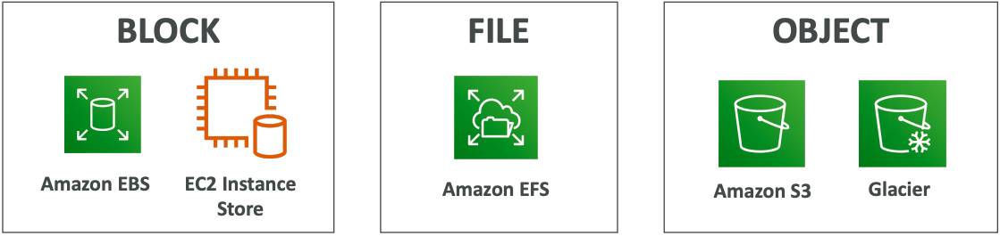

# Stephane Maarek | Ultimate AWS Certified Cloud Practitioner - 2020
## https://itau.udemy.com/course/aws-certified-cloud-practitioner-new/learn/lecture/19891628#overview

---

# Cloud Computing

## The Deployment Models of the Cloud

- **Private Cloud**
    - Cloud services used by a single organization, not exposed to the public
    - Complete control
    - Security for sensitive applications
    - Meet specific business need
- **Public Cloud**
    - Cloud resources owned and operated by a thirdparty cloud service provider delivered over the Internet
    - Six Advantages of Cloud Computing
- **Hybrid Cloud**
    - Keep some servers on premises and extend some capabilities to the Cloud
    - Control over sensitive assets in your private infrastructure
    - Flexibility and costeffectiveness of the public cloud

## Six Advantages of Cloud Computing

- **Trade capital expense (CAPEX) for operational expense (OPEX)**
    - Pay On-Demand: don't own hardware
    - Reduced Total Cost of Ownership (TCO) & Operational Expense (OPEX)
- **Benefit from massice economies of scale**
    - Prices are reduced as AWS is more efficient due to large scale
- **Stop guessing capacity**
    - Scale based on actual measured usage
- **Increase speed and agility**
- **Stop spending money running and maintaining data centers**
- **Go global in minutes** 
    - Leverage the AWS global infrastructure

## Problem Solved by The Cloud

- **Flexibility**: Change resource types when needed
- **Cost-effectiveness**: Pay-as-you-go, for what you use
- **Scalability**: Accommodate larger loads by making hardware stronger or adding additional nodes
- **Elasticity**: Ability to scale out and scale-in when needed
- **High-availability and fault-tolerance**: build across data centers
- **Agility**: rapidly develop, test and launch software applications

## Types of Cloud Computing

- **Infrastructure as a Service (IaaS)**
    - Provide building blocks for cloud IT
    - Provides networking, computers, data storage space
    - Highest level of flexibility
    - Easy parallel with traditional on-premises IT
- **Platform as a Service (PaaS)**
    - Removes the need for your organization to manage the underlying infrastructure
    - Focus on the deployment and management of your applications
- **Software as a Service (SaaS)**
    - Completed product that is run and managed by the service provider

---

# AWS Cloud Overview

## AWS Global Infrastructure

- **AWS Regions**
    - A region is a cluster of data centers
    - Most AWS services are region-scoped
    - Each region has many AZ (Min 2, Max 6 - Usually 3)
- **AWS Availability Zones**
    - Each AZ is one or more discrete data centers with redundant power, networking, and connectivity
    - They're separate from each other, so that they're isolated from disasters
    - They're connected with high bandwidth, ultra-low latency networking
- **AWS Data Centers**
- **AWS Edge Locations / Points of Presence**
    - Content is delivered to end users with lower latency

## Tour of the AWS Console

- AWS has **Global Services**:
    - **Identity and Access Management (IAM)**
    - **Route 53 (DNS Service)**
    - **CloudFront (Content Delivery Networking)**
    - **WAF (Web Application Firewall)**
- **Most AWS services are Region-scoped**:
    - **Amazon EC2 (IaaS)**
    - **Elastic Beanstalk (PaaS)**
    - **Lambda (Function as a Service - FaaS)**
    - **Rekognition (SaaS)**

## Shared Responsability Model diagram

- **Customer** = Responsability for the security **IN** the Cloud
- **AWS** = Responsability fot the security **OF** the Cloud

### Shared Responsability Model for IAM

- AWS
    - Infrastructure (global network security)
    - Configuration and vulnerability analysis
    - Compliance validation
- Customer
    - Users, Groups, Roles, Policies management and monitoring
    - Enable MFA on all accounts
    - Rotate all your keys often
    - Use IAM tools to apply appropriate permissions
    - Analyze access patterns & review permissions

### Shared Responsability Model for EC2

- AWS
    - Infrastructure (global network security)
    - Isolation on physical hosts
    - Replacing faulty hardware
    - Compliance validation
- Customer
    - Security Groups rules
    - Operating-system patches and updates
    - Software and utilities installed on the EC2 instance
    - IAM Roles assigned to EC2 & IAM user access management
    - Data security on your instance

### Shared Responsability Model for EC2 Storage

- AWS
    - Infrastructure
    - Replication for data for EBS volumes & EFS drives
    - Replacing faulty hardware
    - Ensuring their employees cannot access your data
- Customer
    - Setting up backup / snapshot procedures
    - Setting up data encryption
    - Responsibility of any data on the drives
    - Understanding the risk of using EC2 Instance Store

### Shared Responsibility Model for S3

- AWS
    - Infrastructure (global security, durability, availability, sustain concurrent loss of data in two facilities)
    - Configuration and vulnerability analysis
    - Compliance validation
- Customer
    - S3 Versioning
    - S3 Bucket Policies
    - S3 Replication Setup
    - Logging and Monitoring
    - S3 Storage Classes
    - Data encryption at rest and in transit

---

# IAM - Identity and Access Management

## Users and Groups

- IAM is a **Global service**
- **Root account** created by default, *shouldn't be used or shared*
- **Users are people within your organization**, and can be grouped
- **Groups only contain users**, not other groups
- **Users don't have to belong to a group, and user can belong to multiple groups**

## Permissions

- **Users and Groups can be assigned JSON documents called policies**
- These policies define the permissions of the users
- **In AWS you apply the least privilege principle**: don't give more permissions than a user needs

## IAM Roles for Services

- Some AWS service will need to perform actions on your behalf
- To do so, we will assign permissions to AWS services with IAM Roles
- **Common roles**:
    - **EC2 Instance Roles**
    - **Lambda Function Roles**
    - **Roles for CloudFormation**

## IAM Security Tools

- **IAM Credentials Report** (account-level)
    - a report that lists all your account's users and the status of their various credentials
- **IAM Access Advisor** (user-level)
    - Access advisor show the service permissions granted to a user and when those services were last accessed
    - You can use this information to revise your policies

## IAM Guidelines & Best Practices

- Don’t use the root account except for AWS account setup
- One physical user = One AWS user
- **Assign users to groups and assign permissions to groups**
- Create a strong password policy
- **Use and enforce the use of Multi Factor Authentication (MFA)**
- **Create and use Roles for giving permissions to AWS services**
- **Use Access Keys for Programmatic Access (CLI / SDK)**
- **Audit permissions of your account with the IAM Credentials Report**
- Never share IAM users & Access Keys

## IAM Section - Summary

||
|---|
|Users: mapped to a physical user, has a password for AWS Console|
|Groups: contains users only|
|Policies: JSON document that outlines permissions for users or groups|
|Roles: for EC2 instances or AWS services|
|Security: MFA + Password Policy|
|Access Keys: access AWS using the CLI or SDK|
|Audit: IAM Credential Reports & IAM Access Advisor|

---

# AWS CLI

## AWS Access

- To access AWS, you have three options:
    - **AWS Management Console** (protected by password + MFA)
    - **AWS Command Line Interface (CLI)**: Protected by access keys
    - **AWS Software Developer Kit (SDK)** - for code: protected by access keys
- Access Keys are generated through the AWS Console
- Users manage their own access keys
- Access Keys are secret, just like a password. Don't share them
- **Access Key ID ~= username**
- **Secret Access Key ~= password**

---

# EC2 - Elastic Compute Cloud

## Concepts

- EC2 is one of the most popular of AWS’ offering
- EC2 = Elastic Compute Cloud = Infrastructure as a Service (IaaS)
- It mainly consists in the capability of :
    - Renting virtual machines (EC2)
    - Storing data on virtual drives (EBS)
    - Distributing load across machines (ELB)
    - Scaling the services using an auto-scaling group (ASG)

## Introduction to Security Groups

- Security Groups are the fundamental of network security in AWS
- **They control how traffic is allowed into or out of our EC2 Instances**
- **Security groups only contain allow rules**
- Security groups rules **can reference by IP or by security group**

### Security Groups Deeper Dive

- Security groups are **acting as a “firewall” on EC2 instances**
- They regulate:
    - **Access to Ports**
    - **Authorised IP ranges** – IPv4 and IPv6
    - **Control of inbound network** (from other to the instance)
    - **Control of outbound network** (from the instance to other

## EC2 Instance Connect

- Connect to your EC2 instance within your browser
- No need to use your key file that was downloaded
- The “magic” is that a temporary key is uploaded onto EC2 by AWS
- Works only out-of-the-box with Amazon Linux 2
- Need to make sure the port 22 is still opened!

## EC2 Instances Purchasing Options
- **On-Demand Instances**: short workload, predictable pricing
    - Pay for what you use:
        - **Linux - billing per second, after the first minute**
        - **All other operating systems (ex: Windows) - billing per hour**
    - Has the highest cost but **no upfront payment**
    - No long-term commitment
    - **Recommended for short-term and un-interrupted workloads**, where you can't predict how the application will behave
- **Reserved**: (**MINIMUM 1 year**)
    - **Reserved Instances**: long workloads
        - **Up to 72% discount compared to On-demand**
        - **Reservation period**: 1 year = + discount | **3 years = +++ discount**
        - **Purchasing options**: no upfront | partial upfront = + | **All upfront = ++ discount**
        - Reserve a **specific instance type**
        - **Recommended for steady-state usage applications (think database)**
    - **Convertible Reserved Instances**: long workloads with flexible instances
        - **Can change the EC2 instance type**
        - **Up to 45% discount**
    - **Scheduled Reserved Instances**: example – every Thursday between 3 and 6 pm
        - Launch within time window you reserve
        - **When you require a fraction of day / week / month**
        - Commitment for 1 year only
- **Spot Instances**: short workloads, cheap, can lose instances (less reliable)
    - Can get a discount of up to **90% compared to On-demand**
    - **Instances that you can “lose” at any point of time** if your max price is less than the current spot price
    - The **MOST cost-efficient** instances in AWS
    - **Useful for workloads that are resilient to failure**
        - Batch jobs
        - Data analysis
        - Image processing
        - Any distributed workloads
        - Workloads with a flexible start and end time
    - **Not suitable for critical jobs or databases**
- **Dedicated Hosts**: book an entire physical server, control instance placement
    - An Amazon EC2 Dedicated Host is a **physical server with EC2 instance capacity fully dedicated to your use**. Dedicated Hosts can **help you address compliance requirements** and **reduce costs** by allowing you to **use your existing server-bound software licenses**.
    - Allocated for your account for a **3-year period reservation**
    - **More expensive**
    - Useful for software that have complicated licensing model (**BYOL – Bring Your Own License**)
    - Or for **companies that have strong regulatory or compliance needs**
- **Dedicated Instances**: no other customers will share your hardware
    - Instances running on **hardware that’s dedicated to you**
    - **May share hardware with other instances in same account**
    - No control over instance placement (**can move hardware after Stop / Start**)

## EC2 Section – Summary

    - EC2 Instance: AMI (OS) + Instance Size (CPU + RAM) + Storage + security groups + EC2 User Data
    - Security Groups: Firewall attached to the EC2 instance
    - EC2 User Data: Script launched at the first start of an instance
    - SSH: start a terminal into our EC2 Instances (port 22)
    - EC2 Instance Role: link to IAM roles
    - Purchasing Options: On-Demand, Spot, Reserved (Standard + Convertible + Scheduled), Dedicated Host, Dedicated Instance

## EC2 Instance Storage Section

- EBS Volume
    - An EBS (**Elastic Block Store**) Volume is a network drive you can attach to your instances while they run
        - It uses the network to communicate the instance, which means there might be a bit of latency
        - It can be detached from an EC2 instance and attached to another one quickly
    - It **allows your instances to persist data**, even after their termination
    - They can only be **mounted to one instance at a time** (at the CCP level)
    - They are bound to a specific availability zone
        - **It’s locked to an Availability Zone (AZ)**
            - An EBS Volume in us-east-1a cannot be attached to us-east-1b
            - **To move a volume across, you first need to snapshot it**
    - Analogy: Think of them as a “network USB stick”
    - Free tier: 30 GB of free EBS storage of type gp2 per month
        - Have a provisioned capacity (size in GBs, and IOPS)
            - You get **billed for all the provisioned capacity**
            - You **can increase the capacity** of the drive over time

- EBS Snapshots
    - Make a backup (snapshot) of your EBS volume at a point in time
    - **Not necessary to detach** volume to do snapshot, but recommended
    - Can copy snapshots **across AZ or Region**

- AMI Overview
    - **AMI = Amazon Machine Image**
    - AMI are a **customization of an EC2 instance**
        - You add your own software, configuration, operating system, monitoring…
        - Faster boot / configuration time because all your **software is pre-packaged**
    - AMI are built for a **specific region** (and **can be copied across regions**)
    - You can launch EC2 instances from:
        - A **Public AMI**: AWS provided
        - **Your own AMI**: you make and maintain them yourself
        - An **AWS Marketplace AMI**: an AMI someone else made (and potentially sells)

- AMI Process (from an EC2 instance)
    - Start an EC2 instance and customize it
    - Stop the instance (for data integrity)
    - Build an AMI – this will also create EBS snapshots
    - Launch instances from other AMIs

- EC2 Instance Store
    - **High-performance** hardware disk, use EC2 Instance Store
    - Better **I/O** performance
    - EC2 Instance Store lose their storage if they’re stopped (**ephemeral**)
    - Good for **buffer / cache / scratch data / temporary content**
    - Risk of data loss if hardware fails
    - **Backups and Replication are your responsibility**

- EFS – Elastic File System
    - Managed NFS (network file system) that **can be mounted on 100s of EC2**
    - **EFS works with Linux EC2 instances in multi-AZ**
    - **Highly available, scalable, expensive (3x gp2), pay per use, no capacity planning**

- EC2 Instance Storage - Summary
    - EBS volumes:
        - network drives attached to one EC2 instance at a time
        - Mapped to an Availability Zones
        - Can use EBS Snapshots for backups / transferring EBS volumes across AZ
    - AMI: create ready-to-use EC2 instances with our customizations
    - EC2 Instance Store:
        - High performance hardware disk attached to our EC2 instance
        - Lost if our instance is stopped / terminated
    - EFS: network file system, can be attached to 100s of instances in a region

---

# Elastic Load Balancing & Auto Scaling Groups Section

## Scalability & High Availability
- Scalability means that an application / system can handle greater loads by adapting.
- There are **two kinds of scalability**:
    - **Vertical Scalability**
    - **Horizontal Scalability** (= elasticity)
- **Scalability is linked but different to High Availability**

### Vertical Scalability
- Vertical Scalability means **increasing the size of the instance**
    - For example, your application runs on a t2.micro
    - Scaling that application vertically means running it on a t2.large
- Vertical scalability is **very common for non distributed systems, such as a database**.
- There’s usually a limit to how much you can vertically scale (hardware limit)

### Horizontal Scalability
- Horizontal Scalability means **increasing the number of instances** / systems for your application
- Horizontal scaling implies distributed systems
- This is **very common for web applications / modern applications**
- It’s easy to horizontally scale thanks the cloud offerings such as Amazon EC2

### High Availability
- High Availability usually goes hand in hand with **horizontal scaling**
- High availability means running your application / system in at **least 2 Availability Zones**
- The goal of **high availability is to survive a data center loss (disaster)**

### High Availability & Scalability For EC2
- **Vertical Scaling: Increase instance size (= scale up / down)**
    - From: t2.nano - 0.5G of RAM, 1 vCPU
    - To: u-12tb1.metal – 12.3 TB of RAM, 448 vCPUs
- **Horizontal Scaling: Increase number of instances (= scale out / in)**
    - Auto Scaling Group
    - Load Balancer
- **High Availability: Run instances for the same application across multi AZ**
    - Auto Scaling Group multi AZ
    - Load Balancer multi AZ

### Scalability vs Elasticity (vs Agility)
- Scalability
    - Ability to accommodate a larger load by making the hardware stronger (**scale up), or by adding nodes (scale out)**
- Elasticity
    - Once a system is scalable, elasticity means that there will be some “auto-scaling” so that the system can **scale based on the load**. This is “cloud-friendly”: **pay-per-use, match demand, optimize costs**
- Agility
    - (not related to scalability - distractor) new IT resources are **only a click away**, which means that you **reduce the time** to make those resources available **to your developers from weeks to just minutes**

### What is load balancing?
- Load balancers are servers that forward **internet traffic to multiple servers** (EC2 Instances) downstream

### Why use a load balancer? 
- **Spread load across multiple downstream instances** 
- Expose a **single point of access (DNS)** to your application 
- Seamlessly handle failures of downstream instances 
- **Do regular health checks to your instances** 
- Provide **SSL termination (HTTPS) for your websites** 
- **High availability across zones**

### Why use an Elastic Load Balancer?
- An ELB (Elastic Load Balancer) is a **managed load balancer**
    - **AWS guarantees that it will be working**
    - **AWS takes care of upgrades, maintenance, high availability**
    - **AWS provides only a few configuration knobs**
- It costs less to setup your own load balancer but it will be a lot more effort on your end (maintenance, integrations)
- 3 kinds of load balancers offered by AWS:
    - **Application Load Balancer (HTTP / HTTPS only) – Layer 7**
    - **Network Load Balancer (ultra-high performance, allows for TCP) – Layer 4**
    - **Classic Load Balancer (slowly retiring) – Layer 4 & 7**

### What’s an Auto Scaling Group?
- In real-life, the load on your websites and application can change
- In the cloud, you can create and get rid of servers very quickly
- The goal of an Auto Scaling Group (ASG) is to:
    - **Scale out (add EC2 instances) to match an increased load**
    - **Scale in (remove EC2 instances) to match a decreased load**
    - **Ensure we have a minimum and a maximum number of machines running**
    - **Automatically register new instances to a load balancer**
    - **Replace unhealthy instances**
- **Cost Savings**: only run at an optimal capacity (principle of the cloud)

## ELB & ASG – Summary
||
|---|
|High Availability vs Scalability (vertical and horizontal) vs Elasticity vs Agility in the Cloud|
|Elastic Load Balancers (ELB)|
|Distribute traffic across backend EC2 instances, can be Multi-AZ|
|Supports health checks|
|3 types: Application LB (HTTP – L7), Network LB (TCP – L4), Classic LB (old)|
|Auto Scaling Groups (ASG)|
|Implement Elasticity for your application, across multiple AZ|
|Scale EC2 instances based on the demand on your system, replace unhealthy|
|Integrated with the ELB|

---

# Amazon S3 Section

## S3 Use cases
- Backup and storage
- Disaster Recovery
- Archive
- Hybrid Cloud storage
- Application hosting
- Media hosting
- Data lakes & big data analytics
- Software delivery
- Static website

## Buckets
- Amazon S3 allows people to **store objects** (files) in “buckets” (directories)
- Buckets must have a **globally unique name** (across all regions all accounts)
- Buckets are defined at the **region level**
- S3 looks like a global service but buckets are created in a region
- Naming convention
    - No uppercase
    - No underscore
    - 3-63 characters long
    - Not an IP
    - Must start with lowercase letter or number

## Objects
- **Objects (files) have a Key**
- The **key is the FULL path**:
    - s3://my-bucket/my_file.txt
    - s3://my-bucket/my_folder1/another_folder/my_file.txt
- The key is **composed of prefix + object name**
    - s3://my-bucket/my_folder1/another_folder/my_file.txt
- **There’s no concept of “directories”** within buckets (although the UI will trick you to think otherwise)
- **Just keys with very long names that contain slashes (“/”)**
- Object **values are the content of the body**:
    - **Max Object Size is 5TB** (5000GB)
    - **If uploading more than 5GB, must use “multi-part upload”**
- **Metadata (list of text key / value pairs – system or user metadata)**
- **Tags (Unicode key / value pair – up to 10) – useful for security / lifecycle**
- **Version ID (if versioning is enabled)**

## S3 Security
- **User based**
    - **IAM policies** - which API calls should be allowed for a specific user from IAM console
- **Resource Based**
    - **Bucket Policies** - bucket wide rules from the S3 console - allows cross account
    - **Object Access Control List (ACL)** – finer grain
    - **Bucket Access Control List (ACL)** – less common
- **Note**: **an IAM principal can access an S3 object if**
    - **the user IAM permissions allow it OR the resource policy ALLOWS it**
    - **AND there’s no explicit DENY**
- **Encryption: encrypt objects in Amazon S3 using encryption keys**

## S3 Bucket Policies
- **JSON based policies**
    - **Resources: buckets and objects**
    - **Actions**: Set of API to **Allow or Deny**
    - **Effect: Allow / Deny**
    - **Principal**: The **account or user **to apply the policy to
- **Use S3 bucket for policy to**:
    - **Grant public access** to the bucket
    - **Force objects to be encrypted at upload**
    - Grant access to another account (**Cross Account**)

## Bucket settings for Block Public Access
- These settings were created to **prevent company data leaks**
- If you know your bucket should never be public, leave these on
- Can be set at the **account level**

## S3 Websites
- S3 **can host static websites** and have them **accessible on the www**
- The website URL will be:
    - <'bucket-name'>.s3-website-<'AWS-region'>.amazonaws.com
- If you get a 403 (Forbidden) error, **make sure the bucket policy allows public reads**!

## Versioning
- You can version your files in Amazon S3
- It is enabled at the **bucket level**
- **Same key overwrite will increment the “version”: 1, 2, 3...**
- It is best practice to version your buckets
    - **Protect against unintended deletes (ability to restore a version)**
    - **Easy roll back to previous version**
- Notes:
    - **Any file that is not versioned prior to enabling versioning will have version “null”**
    - **Suspending versioning does not delete the previous versions**

## S3 Access Logs
- **For audit purpose**, you may want to log all access to S3 buckets
- **Any request made to S3**, from any account, authorized or denied, will be **logged into another S3 bucket**
- That data can be analyzed using data analysis tools...
- Very helpful to come down to the root cause of an issue, or audit usage, view suspicious patterns, etc...

## S3 Replication (CRR & SRR)
- **Must enable versioning in source and destination**
- **Cross Region Replication (CRR)**
- **Same Region Replication (SRR)**
- Buckets **can be in different accounts**
- Copying is **asynchronous**
- **Must give proper IAM permissions** to S3
- **CRR - Use cases: compliance, lower latency access, replication across accounts**
- **SRR – Use cases: log aggregation, live replication between production and test accounts**

## S3 Storage Classes
- **Amazon S3 Standard** - General Purpose
    - 99.99% Availability
    - Used for **frequently accessed data**
    - **Low latency and high throughput**
    - Sustain 2 concurrent facility failures
    - **Use Cases: Big Data analytics, mobile & gaming applications, content distribution..**
- **Amazon S3 Standard-Infrequent Access (IA)**
    - 99.9% Availability
    - Suitable for data that is **less frequently accessed, but requires rapid access when needed**
    - **Lower cost compared to Amazon S3 Standard**, but **retrieval fee**
    - Sustain 2 concurrent facility failures
    - **Use Cases: As a data store for disaster recovery, backups...**
- **Amazon S3 One Zone-Infrequent Access**
    - **99.5% Availability**
    - **Same as IA but data is stored in a single AZ**
    - **Low latency and high throughput performance**
    - **Lower cost compared to S3-IA (by 20%)**
    - **Use Cases: Storing secondary backup copies of on-premise data, or storing data you can recreate**
- **Amazon S3 Intelligent Tiering**
    - 99.9% Availability
    - **Same low latency and high throughput performance of S3 Standard**
    - **Cost-optimized** by **automatically moving objects between two access tiers** based on changing access patterns:
        - **Frequent access**
        - **Infrequent access**
    - **Resilient** against events that impact an entire Availability Zone
- **Amazon Glacier**
    - **Low cost object storage** (in GB/month) meant for archiving / backup
    - Data is retained for the **longer term (years)**
    - Various retrieval options of time + **fees for retrieval**:
    - **Amazon Glacier – cheap**:
        - **Expedited (1 to 5 minutes)**
        - **Standard (3 to 5 hours)**
        - **Bulk (5 to 12 hours)**
- **Amazon Glacier Deep Archive**
    - **Low cost object storage** (in GB/month) meant for archiving / backup
    - Data is retained for the **longer term (years)**
    - Various retrieval options of time + **fees for retrieval**:
    - **Amazon Glacier Deep Archive – cheapest**:
        - **Standard (12 hours)**
        - **Bulk (48 hours)**
- **Amazon S3 Reduced Redundancy Storage** (deprecated - omitted)

## S3 Durability and Availability
- **Durability**:
    - High durability (99.999999999%, **11 9’s**) **of objects across multiple AZ**
    - If you store 10,000,000 objects with Amazon S3, you can on average expect to incur a loss of a single object once every 10,000 years
    - Same **for all storage classes**
- **Availability**:
    - Measures how readily available a service is
    - S3 standard has **99.99% availability**, which means it will not be available 53 minutes a year
    - Varies **depending on storage class**

## S3 Storage Classes Comparison

## S3 - Moving between storage classes
- You can **transition objects between storage classes**
- For **infrequently accessed object, move them to STANDARD_IA**
- For **archive objects you don’t need in real-time, GLACIER or DEEP_ARCHIVE**
- Moving objects **can be automated using a lifecycle configuration**

## Snowball
- **Physical data transport** solution that helps moving **TBs or PBs** of data in or out of AWS
- Alternative to moving data over the network (and paying network fees)
- **Pay per data transfer job** 
- **Use cases: large data cloud migrations, DC decommission, disaster recovery**
- *If it takes more than a week to transfer over the network, use Snowball devices!*

## Snowball Process
1. Request snowball devices from the AWS console for delivery
2. Install the snowball client on your servers
3. Connect the snowball to your servers and copy files using the client
4. Ship back the device when you’re done (goes to the right AWS
facility)
5. Data will be loaded into an S3 bucket
6. Snowball is completely wiped

## Snowball Edge
- **Snowball Edges (100 TB) add computational capability to the device**
- **Supports a custom EC2 AMI** so you can perform processing on the go
- **Supports custom Lambda functions**
- **Very useful to pre-process the data while moving**
- **Use case: data migration, image collation, IoT capture, machine learning**
- **“Snowball” is deprecated in favor of “Snowball Edge”**

## AWS Snowmobile
- Transfer **exabytes of data** (1 EB = 1,000 PB = 1,000,000 TBs)
- **Each Snowmobile has 100 PB of capacity** (use multiple in parallel)
- Better than Snowball **if you transfer more than 10 PB**

## Hybrid Cloud for Storage
- AWS is pushing for ”hybrid cloud”
    - **Part of your infrastructure is on-premises**
    - **Part of your infrastructure is on the cloud**
- This can be due to
    - Long cloud migrations
    - Security requirements
    - Compliance requirements
    - IT strategy
- S3 is a proprietary storage technology (unlike EFS / NFS), so **how do you expose the S3 data on-premise**?
    - **AWS Storage Gateway**!

## AWS Storage Cloud Native Options

## AWS Storage Gateway
- **Bridge between on-premise data and cloud data in S3**
- Hybrid storage service to allow on- premises to seamlessly use the AWS Cloud
- **Use cases: disaster recovery, backup & restore, tiered storage**
- **Types of Storage Gateway**:
    - **File Gateway**
    - **Volume Gateway**
    - **Tape Gateway**
- *No need to know the types at the exam*

## Amazon S3 – Summary
||
|---|
|Buckets vs Objects: global unique name, tied to a region|
|S3 security: IAM policy, S3 Bucket Policy (public access), S3 Encryption|
|S3 Websites: host a static website on Amazon S3|
|S3 Versioning: multiple versions for files, prevent accidental deletes|
|S3 Access Logs: log requests made within your S3 bucket|
|S3 Replication: same-region or cross-region, must enable versioning|
|S3 Storage Classes: Standard, IA, 1Z-IA, Intelligent, Glacier, Deep Archive|
|S3 Lifecycle Rules: transition objects between classes|
|Snowball / Snowmobile: import data onto S3 through a physical device|
|Storage Gateway: hybrid solution to extend on-premises storage to S3|

---
