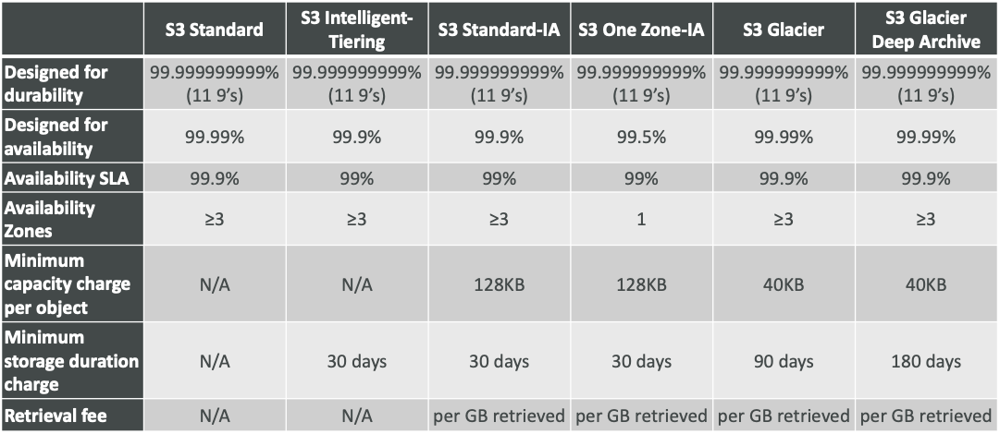

# Stephane Maarek | Ultimate AWS Certified Cloud Practitioner - 2020
## https://itau.udemy.com/course/aws-certified-cloud-practitioner-new/learn/lecture/19891628#overview

---

# Cloud Computing

## The Deployment Models of the Cloud

- **Private Cloud**
    - Cloud services used by a single organization, not exposed to the public
    - Complete control
    - Security for sensitive applications
    - Meet specific business need
- **Public Cloud**
    - Cloud resources owned and operated by a thirdparty cloud service provider delivered over the Internet
    - Six Advantages of Cloud Computing
- **Hybrid Cloud**
    - Keep some servers on premises and extend some capabilities to the Cloud
    - Control over sensitive assets in your private infrastructure
    - Flexibility and costeffectiveness of the public cloud

## Six Advantages of Cloud Computing

- **Trade capital expense (CAPEX) for operational expense (OPEX)**
    - Pay On-Demand: don't own hardware
    - Reduced Total Cost of Ownership (TCO) & Operational Expense (OPEX)
- **Benefit from massice economies of scale**
    - Prices are reduced as AWS is more efficient due to large scale
- **Stop guessing capacity**
    - Scale based on actual measured usage
- **Increase speed and agility**
- **Stop spending money running and maintaining data centers**
- **Go global in minutes** 
    - Leverage the AWS global infrastructure

## Problem Solved by The Cloud

- **Flexibility**: Change resource types when needed
- **Cost-effectiveness**: Pay-as-you-go, for what you use
- **Scalability**: Accommodate larger loads by making hardware stronger or adding additional nodes
- **Elasticity**: Ability to scale out and scale-in when needed
- **High-availability and fault-tolerance**: build across data centers
- **Agility**: rapidly develop, test and launch software applications

## Types of Cloud Computing

- **Infrastructure as a Service (IaaS)**
    - Provide building blocks for cloud IT
    - Provides networking, computers, data storage space
    - Highest level of flexibility
    - Easy parallel with traditional on-premises IT
- **Platform as a Service (PaaS)**
    - Removes the need for your organization to manage the underlying infrastructure
    - Focus on the deployment and management of your applications
- **Software as a Service (SaaS)**
    - Completed product that is run and managed by the service provider

---

# AWS Cloud Overview

## AWS Global Infrastructure

- **AWS Regions**
    - A region is a cluster of data centers
    - Most AWS services are region-scoped
    - Each region has many AZ (Min 2, Max 6 - Usually 3)
- **AWS Availability Zones**
    - Each AZ is one or more discrete data centers with redundant power, networking, and connectivity
    - They're separate from each other, so that they're isolated from disasters
    - They're connected with high bandwidth, ultra-low latency networking
- **AWS Data Centers**
- **AWS Edge Locations / Points of Presence**
    - Content is delivered to end users with lower latency

## Tour of the AWS Console

- AWS has **Global Services**:
    - **Identity and Access Management (IAM)**
    - **Route 53 (DNS Service)**
    - **CloudFront (Content Delivery Networking)**
    - **WAF (Web Application Firewall)**
- **Most AWS services are Region-scoped**:
    - **Amazon EC2 (IaaS)**
    - **Elastic Beanstalk (PaaS)**
    - **Lambda (Function as a Service - FaaS)**
    - **Rekognition (SaaS)**

## Shared Responsability Model diagram

- **Customer** = Responsability for the security **IN** the Cloud
- **AWS** = Responsability fot the security **OF** the Cloud

### Shared Responsability Model for IAM

- AWS
    - Infrastructure (global network security)
    - Configuration and vulnerability analysis
    - Compliance validation
- Customer
    - Users, Groups, Roles, Policies management and monitoring
    - Enable MFA on all accounts
    - Rotate all your keys often
    - Use IAM tools to apply appropriate permissions
    - Analyze access patterns & review permissions

### Shared Responsability Model for EC2

- AWS
    - Infrastructure (global network security)
    - Isolation on physical hosts
    - Replacing faulty hardware
    - Compliance validation
- Customer
    - Security Groups rules
    - Operating-system patches and updates
    - Software and utilities installed on the EC2 instance
    - IAM Roles assigned to EC2 & IAM user access management
    - Data security on your instance

### Shared Responsability Model for EC2 Storage

- AWS
    - Infrastructure
    - Replication for data for EBS volumes & EFS drives
    - Replacing faulty hardware
    - Ensuring their employees cannot access your data
- Customer
    - Setting up backup / snapshot procedures
    - Setting up data encryption
    - Responsibility of any data on the drives
    - Understanding the risk of using EC2 Instance Store

### Shared Responsibility Model for S3

- AWS
    - Infrastructure (global security, durability, availability, sustain concurrent loss of data in two facilities)
    - Configuration and vulnerability analysis
    - Compliance validation
- Customer
    - S3 Versioning
    - S3 Bucket Policies
    - S3 Replication Setup
    - Logging and Monitoring
    - S3 Storage Classes
    - Data encryption at rest and in transit

### Databases & Shared Responsibility on AWS
- AWS
    - Offers use to manage different databases
    - Benefits include:
        - Quick Provisioning, High Availability, Vertical and Horizontal Scaling
        - Automated Backup & Restore, Operations, Upgrades
        - Operating System Patching is handled by AWS
        - Monitoring, alerting
- Customer
    - Many databases technologies could be run on EC2, but you must handle yourself the resiliency, backup, patching, high availability, fault tolerance, scaling...

---

# IAM - Identity and Access Management

## Users and Groups

- IAM is a **Global service**
- **Root account** created by default, *shouldn't be used or shared*
- **Users are people within your organization**, and can be grouped
- **Groups only contain users**, not other groups
- **Users don't have to belong to a group, and user can belong to multiple groups**

## Permissions

- **Users and Groups can be assigned JSON documents called policies**
- These policies define the permissions of the users
- **In AWS you apply the least privilege principle**: don't give more permissions than a user needs

## IAM Roles for Services

- Some AWS service will need to perform actions on your behalf
- To do so, we will assign permissions to AWS services with IAM Roles
- **Common roles**:
    - **EC2 Instance Roles**
    - **Lambda Function Roles**
    - **Roles for CloudFormation**

## IAM Security Tools

- **IAM Credentials Report** (account-level)
    - a report that lists all your account's users and the status of their various credentials
- **IAM Access Advisor** (user-level)
    - Access advisor show the service permissions granted to a user and when those services were last accessed
    - You can use this information to revise your policies

## IAM Guidelines & Best Practices

- Don’t use the root account except for AWS account setup
- One physical user = One AWS user
- **Assign users to groups and assign permissions to groups**
- Create a strong password policy
- **Use and enforce the use of Multi Factor Authentication (MFA)**
- **Create and use Roles for giving permissions to AWS services**
- **Use Access Keys for Programmatic Access (CLI / SDK)**
- **Audit permissions of your account with the IAM Credentials Report**
- Never share IAM users & Access Keys

## IAM Section - Summary

||
|---|
|Users: mapped to a physical user, has a password for AWS Console|
|Groups: contains users only|
|Policies: JSON document that outlines permissions for users or groups|
|Roles: for EC2 instances or AWS services|
|Security: MFA + Password Policy|
|Access Keys: access AWS using the CLI or SDK|
|Audit: IAM Credential Reports & IAM Access Advisor|

---

# AWS CLI

## AWS Access

- To access AWS, you have three options:
    - **AWS Management Console** (protected by password + MFA)
    - **AWS Command Line Interface (CLI)**: Protected by access keys
    - **AWS Software Developer Kit (SDK)** - for code: protected by access keys
- Access Keys are generated through the AWS Console
- Users manage their own access keys
- Access Keys are secret, just like a password. Don't share them
- **Access Key ID ~= username**
- **Secret Access Key ~= password**

---

# EC2 - Elastic Compute Cloud

## Concepts

- EC2 is one of the most popular of AWS’ offering
- EC2 = Elastic Compute Cloud = Infrastructure as a Service (IaaS)
- It mainly consists in the capability of :
    - Renting virtual machines (EC2)
    - Storing data on virtual drives (EBS)
    - Distributing load across machines (ELB)
    - Scaling the services using an auto-scaling group (ASG)

## Introduction to Security Groups

- Security Groups are the fundamental of network security in AWS
- **They control how traffic is allowed into or out of our EC2 Instances**
- **Security groups only contain allow rules**
- Security groups rules **can reference by IP or by security group**

### Security Groups Deeper Dive

- Security groups are **acting as a “firewall” on EC2 instances**
- They regulate:
    - **Access to Ports**
    - **Authorised IP ranges** – IPv4 and IPv6
    - **Control of inbound network** (from other to the instance)
    - **Control of outbound network** (from the instance to other

## EC2 Instance Connect

- Connect to your EC2 instance within your browser
- No need to use your key file that was downloaded
- The “magic” is that a temporary key is uploaded onto EC2 by AWS
- **Works only out-of-the-box with Amazon Linux 2**
- **Need to make sure the port 22 is still opened!**

## EC2 Instances Purchasing Options
- **On-Demand Instances**: short workload, predictable pricing
    - Pay for what you use:
        - **Linux - billing per second, after the first minute**
        - **All other operating systems (ex: Windows) - billing per hour**
    - Has the highest cost but **no upfront payment**
    - No long-term commitment
    - **Recommended for short-term and un-interrupted workloads**, where you can't predict how the application will behave
- **Reserved**: (**MINIMUM 1 year**)
    - **Reserved Instances**: long workloads
        - **Up to 72% discount compared to On-demand**
        - **Reservation period**: 1 year = + discount | **3 years = +++ discount**
        - **Purchasing options**: no upfront | partial upfront = + | **All upfront = ++ discount**
        - Reserve a **specific instance type**
        - **Recommended for steady-state usage applications (think database)**
    - **Convertible Reserved Instances**: long workloads with flexible instances
        - **Can change the EC2 instance type**
        - **Up to 45% discount**
    - **Scheduled Reserved Instances**: example – every Thursday between 3 and 6 pm
        - Launch within time window you reserve
        - **When you require a fraction of day / week / month**
        - Commitment for 1 year only
- **Spot Instances**: short workloads, cheap, can lose instances (less reliable)
    - Can get a discount of up to **90% compared to On-demand**
    - **Instances that you can “lose” at any point of time** if your max price is less than the current spot price
    - The **MOST cost-efficient** instances in AWS
    - **Useful for workloads that are resilient to failure**
        - Batch jobs
        - Data analysis
        - Image processing
        - Any distributed workloads
        - Workloads with a flexible start and end time
    - **Not suitable for critical jobs or databases**
- **Dedicated Hosts**: book an entire physical server, control instance placement
    - An Amazon EC2 Dedicated Host is a **physical server with EC2 instance capacity fully dedicated to your use**. Dedicated Hosts can **help you address compliance requirements** and **reduce costs** by allowing you to **use your existing server-bound software licenses**.
    - Allocated for your account for a **3-year period reservation**
    - **More expensive**
    - Useful for software that have complicated licensing model (**BYOL – Bring Your Own License**)
    - Or for **companies that have strong regulatory or compliance needs**
- **Dedicated Instances**: no other customers will share your hardware
    - Instances running on **hardware that’s dedicated to you**
    - **May share hardware with other instances in same account**
    - No control over instance placement (**can move hardware after Stop / Start**)

## EC2 Section – Summary

    - EC2 Instance: AMI (OS) + Instance Size (CPU + RAM) + Storage + security groups + EC2 User Data
    - Security Groups: Firewall attached to the EC2 instance
    - EC2 User Data: Script launched at the first start of an instance
    - SSH: start a terminal into our EC2 Instances (port 22)
    - EC2 Instance Role: link to IAM roles
    - Purchasing Options: On-Demand, Spot, Reserved (Standard + Convertible + Scheduled), Dedicated Host, Dedicated Instance

## EC2 Instance Storage Section

- EBS Volume
    - An EBS (**Elastic Block Store**) Volume is a network drive you can attach to your instances while they run
        - It uses the network to communicate the instance, which means there might be a bit of latency
        - It can be detached from an EC2 instance and attached to another one quickly
    - It **allows your instances to persist data**, even after their termination
    - They can only be **mounted to one instance at a time** (at the CCP level)
    - They are bound to a specific availability zone
        - **It’s locked to an Availability Zone (AZ)**
            - An EBS Volume in us-east-1a cannot be attached to us-east-1b
            - **To move a volume across, you first need to snapshot it**
    - Analogy: Think of them as a “network USB stick”
    - Free tier: 30 GB of free EBS storage of type gp2 per month
        - Have a provisioned capacity (size in GBs, and IOPS)
            - You get **billed for all the provisioned capacity**
            - You **can increase the capacity** of the drive over time

- EBS Snapshots
    - Make a backup (snapshot) of your EBS volume at a point in time
    - **Not necessary to detach** volume to do snapshot, but recommended
    - Can copy snapshots **across AZ or Region**

- AMI Overview
    - **AMI = Amazon Machine Image**
    - AMI are a **customization of an EC2 instance**
        - You add your own software, configuration, operating system, monitoring…
        - Faster boot / configuration time because all your **software is pre-packaged**
    - AMI are built for a **specific region** (and **can be copied across regions**)
    - You can launch EC2 instances from:
        - A **Public AMI**: AWS provided
        - **Your own AMI**: you make and maintain them yourself
        - An **AWS Marketplace AMI**: an AMI someone else made (and potentially sells)

- AMI Process (from an EC2 instance)
    - Start an EC2 instance and customize it
    - Stop the instance (for data integrity)
    - Build an AMI – this will also create EBS snapshots
    - Launch instances from other AMIs

- EC2 Instance Store
    - **High-performance** hardware disk, use EC2 Instance Store
    - Better **I/O** performance
    - EC2 Instance Store lose their storage if they’re stopped (**ephemeral**)
    - Good for **buffer / cache / scratch data / temporary content**
    - Risk of data loss if hardware fails
    - **Backups and Replication are your responsibility**

- EFS – Elastic File System
    - Managed NFS (network file system) that **can be mounted on 100s of EC2**
    - **EFS works with Linux EC2 instances in multi-AZ**
    - **Highly available, scalable, expensive (3x gp2), pay per use, no capacity planning**

- EC2 Instance Storage - Summary
    - EBS volumes:
        - network drives attached to one EC2 instance at a time
        - Mapped to an Availability Zones
        - Can use EBS Snapshots for backups / transferring EBS volumes across AZ
    - AMI: create ready-to-use EC2 instances with our customizations
    - EC2 Instance Store:
        - High performance hardware disk attached to our EC2 instance
        - Lost if our instance is stopped / terminated
    - EFS: network file system, can be attached to 100s of instances in a region

---

# Elastic Load Balancing & Auto Scaling Groups Section

## Scalability & High Availability
- Scalability means that an application / system can handle greater loads by adapting.
- There are **two kinds of scalability**:
    - **Vertical Scalability**
    - **Horizontal Scalability** (= elasticity)
- **Scalability is linked but different to High Availability**

### Vertical Scalability
- Vertical Scalability means **increasing the size of the instance**
    - For example, your application runs on a t2.micro
    - Scaling that application vertically means running it on a t2.large
- Vertical scalability is **very common for non distributed systems, such as a database**.
- There’s usually a limit to how much you can vertically scale (hardware limit)

### Horizontal Scalability
- Horizontal Scalability means **increasing the number of instances** / systems for your application
- Horizontal scaling implies distributed systems
- This is **very common for web applications / modern applications**
- It’s easy to horizontally scale thanks the cloud offerings such as Amazon EC2

### High Availability
- High Availability usually goes hand in hand with **horizontal scaling**
- High availability means running your application / system in at **least 2 Availability Zones**
- The goal of **high availability is to survive a data center loss (disaster)**

### High Availability & Scalability For EC2
- **Vertical Scaling: Increase instance size (= scale up / down)**
    - From: t2.nano - 0.5G of RAM, 1 vCPU
    - To: u-12tb1.metal – 12.3 TB of RAM, 448 vCPUs
- **Horizontal Scaling: Increase number of instances (= scale out / in)**
    - Auto Scaling Group
    - Load Balancer
- **High Availability: Run instances for the same application across multi AZ**
    - Auto Scaling Group multi AZ
    - Load Balancer multi AZ

### Scalability vs Elasticity (vs Agility)
- Scalability
    - Ability to accommodate a larger load by making the hardware stronger (**scale up), or by adding nodes (scale out)**
- Elasticity
    - Once a system is scalable, elasticity means that there will be some “auto-scaling” so that the system can **scale based on the load**. This is “cloud-friendly”: **pay-per-use, match demand, optimize costs**
- Agility
    - (not related to scalability - distractor) new IT resources are **only a click away**, which means that you **reduce the time** to make those resources available **to your developers from weeks to just minutes**

### What is load balancing?
- Load balancers are servers that forward **internet traffic to multiple servers** (EC2 Instances) downstream

### Why use a load balancer? 
- **Spread load across multiple downstream instances** 
- Expose a **single point of access (DNS)** to your application 
- Seamlessly handle failures of downstream instances 
- **Do regular health checks to your instances** 
- Provide **SSL termination (HTTPS) for your websites** 
- **High availability across zones**

### Why use an Elastic Load Balancer?
- An ELB (Elastic Load Balancer) is a **managed load balancer**
    - **AWS guarantees that it will be working**
    - **AWS takes care of upgrades, maintenance, high availability**
    - **AWS provides only a few configuration knobs**
- It costs less to setup your own load balancer but it will be a lot more effort on your end (maintenance, integrations)
- 3 kinds of load balancers offered by AWS:
    - **Application Load Balancer (HTTP / HTTPS only) – Layer 7**
    - **Network Load Balancer (ultra-high performance, allows for TCP) – Layer 4**
    - **Classic Load Balancer (slowly retiring) – Layer 4 & 7**

### What’s an Auto Scaling Group?
- In real-life, the load on your websites and application can change
- In the cloud, you can create and get rid of servers very quickly
- The goal of an Auto Scaling Group (ASG) is to:
    - **Scale out (add EC2 instances) to match an increased load**
    - **Scale in (remove EC2 instances) to match a decreased load**
    - **Ensure we have a minimum and a maximum number of machines running**
    - **Automatically register new instances to a load balancer**
    - **Replace unhealthy instances**
- **Cost Savings**: only run at an optimal capacity (principle of the cloud)

## ELB & ASG – Summary
||
|---|
|High Availability vs Scalability (vertical and horizontal) vs Elasticity vs Agility in the Cloud|
|Elastic Load Balancers (ELB)|
|Distribute traffic across backend EC2 instances, can be Multi-AZ|
|Supports health checks|
|3 types: Application LB (HTTP – L7), Network LB (TCP – L4), Classic LB (old)|
|Auto Scaling Groups (ASG)|
|Implement Elasticity for your application, across multiple AZ|
|Scale EC2 instances based on the demand on your system, replace unhealthy|
|Integrated with the ELB|

---

# Amazon S3 Section

## S3 Use cases
- Backup and storage
- Disaster Recovery
- Archive
- Hybrid Cloud storage
- Application hosting
- Media hosting
- Data lakes & big data analytics
- Software delivery
- Static website

## Buckets
- Amazon S3 allows people to **store objects** (files) in “buckets” (directories)
- Buckets must have a **globally unique name** (across all regions all accounts)
- Buckets are defined at the **region level**
- S3 looks like a global service but buckets are created in a region
- Naming convention
    - No uppercase
    - No underscore
    - 3-63 characters long
    - Not an IP
    - Must start with lowercase letter or number

## Objects
- **Objects (files) have a Key**
- The **key is the FULL path**:
    - s3://my-bucket/my_file.txt
    - s3://my-bucket/my_folder1/another_folder/my_file.txt
- The key is **composed of prefix + object name**
    - s3://my-bucket/my_folder1/another_folder/my_file.txt
- **There’s no concept of “directories”** within buckets (although the UI will trick you to think otherwise)
- **Just keys with very long names that contain slashes (“/”)**
- Object **values are the content of the body**:
    - **Max Object Size is 5TB** (5000GB)
    - **If uploading more than 5GB, must use “multi-part upload”**
- **Metadata (list of text key / value pairs – system or user metadata)**
- **Tags (Unicode key / value pair – up to 10) – useful for security / lifecycle**
- **Version ID (if versioning is enabled)**

## S3 Security
- **User based**
    - **IAM policies** - which API calls should be allowed for a specific user from IAM console
- **Resource Based**
    - **Bucket Policies** - bucket wide rules from the S3 console - allows cross account
    - **Object Access Control List (ACL)** – finer grain
    - **Bucket Access Control List (ACL)** – less common
- **Note**: **an IAM principal can access an S3 object if**
    - **the user IAM permissions allow it OR the resource policy ALLOWS it**
    - **AND there’s no explicit DENY**
- **Encryption: encrypt objects in Amazon S3 using encryption keys**

## S3 Bucket Policies
- **JSON based policies**
    - **Resources: buckets and objects**
    - **Actions**: Set of API to **Allow or Deny**
    - **Effect: Allow / Deny**
    - **Principal**: The **account or user **to apply the policy to
- **Use S3 bucket for policy to**:
    - **Grant public access** to the bucket
    - **Force objects to be encrypted at upload**
    - Grant access to another account (**Cross Account**)

## Bucket settings for Block Public Access
- These settings were created to **prevent company data leaks**
- If you know your bucket should never be public, leave these on
- Can be set at the **account level**

## S3 Websites
- S3 **can host static websites** and have them **accessible on the www**
- The website URL will be:
    - <'bucket-name'>.s3-website-<'AWS-region'>.amazonaws.com
- If you get a 403 (Forbidden) error, **make sure the bucket policy allows public reads**!

## Versioning
- You can version your files in Amazon S3
- It is enabled at the **bucket level**
- **Same key overwrite will increment the “version”: 1, 2, 3...**
- It is best practice to version your buckets
    - **Protect against unintended deletes (ability to restore a version)**
    - **Easy roll back to previous version**
- Notes:
    - **Any file that is not versioned prior to enabling versioning will have version “null”**
    - **Suspending versioning does not delete the previous versions**

## S3 Access Logs
- **For audit purpose**, you may want to log all access to S3 buckets
- **Any request made to S3**, from any account, authorized or denied, will be **logged into another S3 bucket**
- That data can be analyzed using data analysis tools...
- Very helpful to come down to the root cause of an issue, or audit usage, view suspicious patterns, etc...

## S3 Replication (CRR & SRR)
- **Must enable versioning in source and destination**
- **Cross Region Replication (CRR)**
- **Same Region Replication (SRR)**
- Buckets **can be in different accounts**
- Copying is **asynchronous**
- **Must give proper IAM permissions** to S3
- **CRR - Use cases: compliance, lower latency access, replication across accounts**
- **SRR – Use cases: log aggregation, live replication between production and test accounts**

## S3 Storage Classes
- **Amazon S3 Standard** - General Purpose
    - 99.99% Availability
    - Used for **frequently accessed data**
    - **Low latency and high throughput**
    - Sustain 2 concurrent facility failures
    - **Use Cases: Big Data analytics, mobile & gaming applications, content distribution..**
- **Amazon S3 Standard-Infrequent Access (IA)**
    - 99.9% Availability
    - Suitable for data that is **less frequently accessed, but requires rapid access when needed**
    - **Lower cost compared to Amazon S3 Standard**, but **retrieval fee**
    - Sustain 2 concurrent facility failures
    - **Use Cases: As a data store for disaster recovery, backups...**
- **Amazon S3 One Zone-Infrequent Access**
    - **99.5% Availability**
    - **Same as IA but data is stored in a single AZ**
    - **Low latency and high throughput performance**
    - **Lower cost compared to S3-IA (by 20%)**
    - **Use Cases: Storing secondary backup copies of on-premise data, or storing data you can recreate**
- **Amazon S3 Intelligent Tiering**
    - 99.9% Availability
    - **Same low latency and high throughput performance of S3 Standard**
    - **Cost-optimized** by **automatically moving objects between two access tiers** based on changing access patterns:
        - **Frequent access**
        - **Infrequent access**
    - **Resilient** against events that impact an entire Availability Zone
- **Amazon Glacier**
    - **Low cost object storage** (in GB/month) meant for archiving / backup
    - Data is retained for the **longer term (years)**
    - Various retrieval options of time + **fees for retrieval**:
    - **Amazon Glacier – cheap**:
        - **Expedited (1 to 5 minutes)**
        - **Standard (3 to 5 hours)**
        - **Bulk (5 to 12 hours)**
- **Amazon Glacier Deep Archive**
    - **Low cost object storage** (in GB/month) meant for archiving / backup
    - Data is retained for the **longer term (years)**
    - Various retrieval options of time + **fees for retrieval**:
    - **Amazon Glacier Deep Archive – cheapest**:
        - **Standard (12 hours)**
        - **Bulk (48 hours)**
- **Amazon S3 Reduced Redundancy Storage** (deprecated - omitted)

## S3 Durability and Availability
- **Durability**:
    - High durability (99.999999999%, **11 9’s**) **of objects across multiple AZ**
    - If you store 10,000,000 objects with Amazon S3, you can on average expect to incur a loss of a single object once every 10,000 years
    - Same **for all storage classes**
- **Availability**:
    - Measures how readily available a service is
    - S3 standard has **99.99% availability**, which means it will not be available 53 minutes a year
    - Varies **depending on storage class**

## S3 Storage Classes Comparison

## S3 - Moving between storage classes
- You can **transition objects between storage classes**
- For **infrequently accessed object, move them to STANDARD_IA**
- For **archive objects you don’t need in real-time, GLACIER or DEEP_ARCHIVE**
- Moving objects **can be automated using a lifecycle configuration**

## Snowball
- **Physical data transport** solution that helps moving **TBs or PBs** of data in or out of AWS
- Alternative to moving data over the network (and paying network fees)
- **Pay per data transfer job** 
- **Use cases: large data cloud migrations, DC decommission, disaster recovery**
- *If it takes more than a week to transfer over the network, use Snowball devices!*

## Snowball Process
1. Request snowball devices from the AWS console for delivery
2. Install the snowball client on your servers
3. Connect the snowball to your servers and copy files using the client
4. Ship back the device when you’re done (goes to the right AWS
facility)
5. Data will be loaded into an S3 bucket
6. Snowball is completely wiped

## Snowball Edge
- **Snowball Edges (100 TB) add computational capability to the device**
- **Supports a custom EC2 AMI** so you can perform processing on the go
- **Supports custom Lambda functions**
- **Very useful to pre-process the data while moving**
- **Use case: data migration, image collation, IoT capture, machine learning**
- **“Snowball” is deprecated in favor of “Snowball Edge”**

## AWS Snowmobile
- Transfer **exabytes of data** (1 EB = 1,000 PB = 1,000,000 TBs)
- **Each Snowmobile has 100 PB of capacity** (use multiple in parallel)
- Better than Snowball **if you transfer more than 10 PB**

## Hybrid Cloud for Storage
- AWS is pushing for ”hybrid cloud”
    - **Part of your infrastructure is on-premises**
    - **Part of your infrastructure is on the cloud**
- This can be due to
    - Long cloud migrations
    - Security requirements
    - Compliance requirements
    - IT strategy
- S3 is a proprietary storage technology (unlike EFS / NFS), so **how do you expose the S3 data on-premise**?
    - **AWS Storage Gateway**!

## AWS Storage Cloud Native Options

## AWS Storage Gateway
- **Bridge between on-premise data and cloud data in S3**
- Hybrid storage service to allow on- premises to seamlessly use the AWS Cloud
- **Use cases: disaster recovery, backup & restore, tiered storage**
- **Types of Storage Gateway**:
    - **File Gateway**
    - **Volume Gateway**
    - **Tape Gateway**
- *No need to know the types at the exam*

## Amazon S3 – Summary
||
|---|
|Buckets vs Objects: global unique name, tied to a region|
|S3 security: IAM policy, S3 Bucket Policy (public access), S3 Encryption|
|S3 Websites: host a static website on Amazon S3|
|S3 Versioning: multiple versions for files, prevent accidental deletes|
|S3 Access Logs: log requests made within your S3 bucket|
|S3 Replication: same-region or cross-region, must enable versioning|
|S3 Storage Classes: Standard, IA, 1Z-IA, Intelligent, Glacier, Deep Archive|
|S3 Lifecycle Rules: transition objects between classes|
|Snowball / Snowmobile: import data onto S3 through a physical device|
|Storage Gateway: hybrid solution to extend on-premises storage to S3|

---

# Databases Section

## Relational Databases

- Looks just **like Excel** spreadsheets, with links between them!
- Can use the **SQL language to perform queries / lookups**

## NoSQL Databases

- NoSQL = non-SQL = **non relational databases**
- NoSQL databases are purpose built for specific data models and have **flexible schemas** for building **modern applications**.
- Benefits:
    - **Flexibility**: easy to evolve data model
    - **Scalability**: designed to scale-out by using distributed clusters
    - **High-performance**: optimized for a specific data model
    - **Highly functional**: types optimized for the data model
- **Examples: Key-value, document, graph, in-memory, search databases**

## AWS RDS Overview
- RDS stands for **Relational Database Service**
- It’s a **managed DB service** for DB use **SQL** as a query language.
- It allows you to create databases in the cloud that are **managed by AWS**
    - **Postgres**
    - **MySQL**
    - **MariaDB**
    - **Oracle**
    - **Microsoft SQL Server**
    - **Aurora** *(AWS Proprietary database)*

### Advantage over using RDS versus deploying DB on EC2
- **RDS is a managed service**:
    - **Automated provisioning, OS patching**
    - **Continuous backups** and restore to specific timestamp (**Point in Time Restore**)!
    - **Monitoring dashboards**
    - **Read replicas for improved read performance**
    - **Multi AZ** setup for DR (Disaster Recovery)
    - Maintenance windows for upgrades
    - **Scaling capability** (vertical and horizontal)
    - **Storage backed by EBS** (gp2 or io1)
- BUT **you can’t SSH into** your instances

## Amazon Aurora
- Aurora is a proprietary **technology from AWS** (not open sourced)
- **PostgreSQL and MySQL** are both supported as Aurora DB
- Aurora is **“AWS cloud optimized”** and claims **5x performance improvement over MySQL on RDS**, over **3x the performance of Postgres on RDS**
- **Aurora storage automatically grows in increments of 10GB, up to 64 TB**
- **Aurora costs more than RDS** (20% more) – but **is more efficient**
- **Not in the free tier**

## Amazon ElastiCache Overview
- The same way RDS is to get managed **Relational Databases**...
- **ElastiCache is to get managed Redis or Memcached**
- Caches are in-memory databases with **high performance, low latency**
- Helps **reduce load off databases for read intensive workloads**
- **AWS takes care of OS maintenance / patching, optimizations, setup, configuration, monitoring, failure recovery and backups**

## DynamoDB
- **Fully Managed Highly available with replication across 3 AZ**
- **NoSQL database** - not a relational database
- **Scales to massive workloads**, distributed **“serverless”** database
- **Millions of requests per seconds**, trillions of row, 100s of TB of storage
- **Fast and consistent in performance**
- Single-digit millisecond latency – **low latency retrieval**
- **Integrated with IAM** for security, authorization and administration
- **Low cost and auto scaling capabilities**
- **Is a key/value database**

## Redshift Overview
- Redshift is **based on PostgreSQL**, but it’s **not used for OLTP**
- **It’s OLAP** – online analytical processing (**analytics and data warehousing**)
- **Load data once every hour, not every second**
- **10x better performance than other data warehouses, scale to PBs of data**
- **Columnar storage of data** (instead of row based)
- **Massively Parallel Query Execution (MPP), highly available**
- **Pay as you go** based on the instances provisioned
- Has a **SQL interface** for performing the queries
- **BI tools such as AWS Quicksight or Tableau integrate with it**

## Amazon EMR
- EMR stands for **“Elastic MapReduce”**
- EMR helps creating **Hadoop clusters (Big Data)** to analyze and process vast amount of data
- The clusters **can be made of hundreds of EC2 instances**
- Also **supports Apache Spark, HBase, Presto, Flink**...
- **EMR takes care of all the provisioning and configuration**
- **Auto-scaling and integrated with Spot instances**
- **Use cases: data processing, machine learning, web indexing, big data...**

## Athena Overview
- Fully **Serverless** database with **SQL capabilities**
- **Used to query data in S3**
- **Pay per query**
- **Output results back to S3**
- Secured through **IAM**
- **Use Case: one-time SQL queries, serverless queries on S3, log analytics**

## AWS Glue
- Managed **extract, transform, and load (ETL)** service
- Useful to **prepare and transform data for analytics**
- Fully **serverless** service

- Glue Data Catalog: catalog of datasets
    - **Can be used by Athena, Redshift, EMR**

## DMS – Database Migration Service
- Quickly and securely **migrate databases to AWS**, resilient, self healing
- The source database remains available during the migration
- **Supports**:
    - **Homogeneous migrations: ex Oracle to Oracle**
    - **Heterogeneous migrations: ex Microsoft SQL Server to Aurora**

## Databases & Analytics Summary in AWS
||
|---|
|Relational Databases - OLTP: RDS & Aurora (SQL)|
|In-memory Database: ElastiCache|
|Key/Value Database: DynamoDB (serverless)|
|Warehouse - OLAP: Redshift (SQL)|
|Hadoop Cluster: EMR|
|Athena: query data on Amazon S3 (serverless & SQL)|
|Glue: Managed ETL (Extract Transform Load) and Data Catalog service|
|Database Migration: DMS|

---

# Containerization

## ECS
- ECS = **Elastic Container Service**
- **Launch Docker containers** on AWS
- **You must provision & maintain the infrastructure** (the EC2 instances)
- **AWS takes care of starting / stopping containers**
- Has **integrations with the Application Load Balancer**

## Fargate 
- **Launch Docker containers** on AWS
- **You do NOT provision the infrastructure** (no EC2 instances to manage) - simpler!
- **Serverless offering** 
- AWS just runs **containers for you based on the CPU / RAM you need**

## ECR 
- **Elastic Container Registry** 
- Private **Docker Registry** on AWS
- This is **where you store your Docker images** so they can be **run by ECS or Fargate**

---

# Serverless

- Serverless is a new paradigm in which the developers don’t have to manage servers anymore...
- They just deploy code
- They just deploy... functions !
- Initially... Serverless == FaaS (Function as a Service)
- Serverless was pioneered by AWS Lambda but now also includes anything that’s managed: “databases, messaging, storage, etc.”
- Serverless does not mean there are no servers... it means you just don’t manage / provision / see them

## Amazon Lambda

- **Virtual functions** – **no servers to manage**!
- **Limited by time** - short executions
- Run **on-demand**
- **Scaling is automated**! 

## Benefits of AWS Lambda
- Easy Pricing:
    - **Pay per request and compute time**
    - Free tier of 1,000,000 AWS Lambda requests and 400,000 GBs of compute time
- Integrated with the whole AWS suite of services
- Event-Driven: functions get **invoked by AWS when needed**
- **Integrated with many programming languages**
- Easy **monitoring through AWS CloudWatch**
- Easy to **get more resources per functions** (**up to 3GB of RAM!**)
- **Increasing RAM will also improve CPU and network**!

## AWS Lambda language support
- Node.js (JavaScript)
- Python
- Java (Java 8 compatible)
- C# (.NET Core)
- Golang
- C# / Powershell
- Ruby
- Custom Runtime API (community supported, example Rust)
- **Important: Docker is not for AWS Lambda, it’s for ECS / Fargate**

## AWS Lambda Pricing: example
- You can find overall pricing information here:
    - https://aws.amazon.com/lambda/pricing/
- **Pay per calls**:
    - First 1,000,000 requests are free
    - $0.20 per 1 million requests thereafter ($0.0000002 per request)
    - Pay per duration: (in increment of 100ms)
    - 400,000 GB-seconds of compute time per month if FREE
    - == 400,000 seconds if function is 1GB RAM
    - == 3,200,000 seconds if function is 128 MB RAM
    - After that $1.00 for 600,000 GB-seconds
- **It is usually very cheap to run AWS Lambda so it’s very popular**

## AWS Batch
- **Fully managed batch processing at any scale**
- Efficiently run 100,000s of computing batch jobs on AWS
- A “batch” job **is a job with a start and an end** (opposed to continuous)
- Batch will **dynamically launch EC2 instances or Spot Instances**
- AWS Batch **provisions the right amount of compute / memory**
- **You submit or schedule batch jobs** and AWS Batch does the rest!
- Batch jobs **are defined as Docker images and run on ECS**
- Helpful for **cost optimizations and focusing less on the infrastructure**

## Batch vs Lambda
- Lambda:
    - Time limit
    - Limited runtimes
    - Limited temporary disk space
    - Serverless
- Batch:
    - No time limit
    - Any runtime as long as it’s packaged as a Docker image
    - Rely on EBS / instance store for disk space
    - Relies on EC2 (can be managed by AWS)

--

## Amazon Lightsail
- **Virtual servers, storage, databases, and networking**
- **Low & predictable pricing**
- **Simpler alternative to using EC2, RDS, ELB, EBS, Route 53...**
- Great **for people with little cloud experience**!
- **Can setup notifications and monitoring** of your Lightsail resources
- **Use cases**:
    - **Simple web applications** (has templates for LAMP, Nginx, MEAN, Node.js…)
    - **Websites** (templates for WordPress, Magento, Plesk, Joomla)
    - **Dev / Test environment**
- Has **high availability but no auto-scaling**, **limited AWS integrations**

## Containerization - Summary
||
|---|
|Docker: container technology to run applications|
|ECS: run Docker containers on EC2 instances|
|Fargate: Run Docker containers without provisioning the infrastructure / Serverless offering (no EC2 instances)|
|ECR: Private Docker Images Repository|
|Batch: run batch jobs on AWS across managed EC2 instances|
|Lightsail: predictable & low pricing for simple application & DB stacks|

## Lambda Summary
||
|---|
|Lambda is Serverless, Function as a Service, seamless scaling, reactive|
|Lambda Billing: By the time run x by the RAM provisioned / By the number of invocations|
|Language Support: many programming languages except Docker|
|Invocation time: up to 15 minutes|
|Use cases: Create Thumbnails for images uploaded onto S3 / Run a Serverless cron job|

---

# Deploying and Managing Infrastructure at Scale Section

## CloudFormation

- CloudFormation **is a declarative way of outlining your AWS Infrastructure**, for any resources (most of them are supported).
- For example, **within a CloudFormation template**, you say:
    - I want a **security group**
    - I want two **EC2 instances** using this security group
    - I want an **S3 bucket**
    - I want a **load balancer (ELB)** in front of these machines
- Then CloudFormation creates those for you, in the right order, with the exact configuration that you specify

## Benefits of AWS CloudFormation

- **Infrastructure as code** (IaC)
    - **No resources are manually created**, which is excellent for control
    - **Changes** to the infrastructure **are reviewed through code**
- **Cost**
    - Each resources within the stack is tagged with an identifier so you can easily see how much a stack costs you
    - **You can estimate the costs of your resources using the CloudFormation template**
    - Savings strategy: In Dev, you could automation deletion of templates at 5 PM and recreated at 8 AM, safely
- **Productivity**
    - Ability to **destroy and re-create** an infrastructure on the cloud **on the fly**
    - **Automated generation of Diagram** for your templates!
    - Declarative programming (no need to figure out ordering and orchestration)
- Don’t re-invent the wheel
    - Leverage existing templates on the web!
    - Leverage the documentation
- Supports (almost) all AWS resources:
    - You can use “custom resources” for resources that are not supported

## Developer problems on AWS

- *Managing infrastructure*
- *Deploying Code*
- *Configuring all the databases, load balancers, etc*
- *Scaling concerns*
- *Most web apps have the same architecture (ALB + ASG)*
- *All the developers want is for their code to run!*
- *Possibly, consistently across different applications and environments*

## AWS Elastic Beanstalk Overview

- Elastic Beanstalk is a **developer centric view of deploying an application** on AWS
- It uses all the component: EC2, ASG, ELB, RDS, etc...
- But it’s all in **one view** that’s easy to make sense of!
- We still have **full control over the configuration**
- Beanstalk = **Platform as a Service (PaaS)**
- Beanstalk is free but you **pay for the underlying instances**

## Elastic Beanstalk
- Managed service
- Instance configuration / OS is handled by Beanstalk
- Deployment strategy is configurable but performed by Elastic Beanstalk
- **Just the application code is the responsibility of the developer**
- **Three architecture models**:
    - **Single Instance deployment**: good for dev
    - **LB + ASG**: great for production or pre-production web applications
    - **ASG only**: great for non-web apps in production (workers, etc...)

- **Support for many platforms**:
    - Go
    - Java SE
    - Java with Tomcat
    - .NET on Windows Server with IIS
    - Node.js
    - PHP
    - Python
    - Ruby
    - Packer Builder
    - Single Container Docker
    - Multi-Container Docker
    - Preconfigured Docker
    - **If not supported, you can write your custom platform (advanced)**

## AWS CodeDeploy
- We want to **deploy our application automatically**
- **Works with EC2 Instances**
- **Works with On-Premises Servers**
- **Hybrid service**
- Servers / Instances must be provisioned and configured ahead of time with the CodeDeploy Agent

## AWS Systems Manager (SSM)
- Helps you **manage your EC2 and On-Premises systems at scale**
- Another **Hybrid AWS service**
- Get operational **insights about the state of your infrastructure**
- **Suite of 10+ products**
- Most **important features** are:
    - **Patching automation for enhanced compliance**
    - **Run commands across an entire fleet of servers**
    - **Store parameter configuration with the SSM Parameter Store**
- **Works for both Windows and Linux OS**

## How Systems Manager works
- We need to **install the SSM agent onto the systems we control**
- **Installed by default on Amazon Linux AMI & some Ubuntu AMI**
- If an instance can’t be controlled with SSM, it’s probably an issue with the SSM agent!
- Thanks to the SSM agent, we **can run commands, patch & configure our servers**

## AWS OpsWorks
- Chef & Puppet help you perform server configuration automatically, or repetitive actions
- They **work great with EC2 & On-Premises VM**
- **AWS OpsWorks = Managed Chef & Puppet**
- It’s an **alternative to AWS SSM**
- Only **provision standard AWS resources**:
    - **EC2 Instances, Databases, Load Balancers, EBS volumes...**
- ***In the exam: Chef or Puppet needed => AWS OpsWorks***

## Deployment - Summary
||
|---|
|CloudFormation: (AWS only) / Infrastructure as Code (IaC), works with almost all of AWS resources / Repeat across Regions & Accounts|
|Beanstalk: (AWS only) / Platform as a Service (PaaS), limited to certain programming languages or Docker / Deploy code consistently with a known architecture: ex, ALB + EC2 + RDS|
|CodeDeploy (hybrid): deploy & upgrade any application onto servers|
|Systems Manager (hybrid): patch, configure and run commands at scale|
|OpsWorks (hybrid): managed Chef and Puppet in AWS|

---
# Global Application

- A global application is an application deployed in multiple geographies
- On AWS: this could be **Regions and / or Edge Locations**
- **Decreased Latency**
    - Latency is the time it takes for a network packet to reach a server
    - It takes time for a packet from Asia to reach the US
    - **Deploy your applications closer to your users to decrease latency, better experience**
- **Disaster Recovery (DR)**
    - If an AWS region goes down (earthquake, storms, power shutdown, politics)...
    - You can fail-over to another region and have your application still working
    - **A DR plan is important to increase the availability of your application**
- Attack protection: distributed global infrastructure is harder to attack 

## Global AWS Infrastructure
- **Regions**: For deploying applications and infrastructure
- **Availability Zones**: Made of multiple data centers
- **Edge Locations (Points of Presence)**: for content delivery as close as possible to users
- More at: https://infrastructure.aws/

## Global Applications in AWS
- **Global DNS: Route 53**
    - Great to **route users to the closest deployment with least latency**
    - Great for **disaster recovery strategies**
- **Global Content Delivery Network (CDN): CloudFront**
    - Replicate part of your application to AWS Edge Locations – **decrease latency**
    - **Cache common requests – improved user experience** and decreased latency
- **S3 Transfer Acceleration**
    - **Accelerate global uploads & downloads into Amazon S3**
- **AWS Global Accelerator**
    - **Improve global application availability and performance using the AWS global network**

## Amazon Route 53 Overview
- **Route53 is a Managed DNS** (Domain Name System)
- DNS is a collection of rules and records which helps clients understand how to reach a server through URLs.
- In AWS, the most common records are:
    - www.google.com => 12.34.56.78 == A record (IPv4)
    - www.google.com => 2001:0db8:85a3:0000:0000:8a2e:0370:7334 == AAAA IPv6
    - search.google.com => www.google.com == CNAME: hostname to hostname
    - example.com => AWS resource == Alias (ex: ELB, CloudFront, S3, RDS, etc...)

## AWS CloudFront
- **Content Delivery Network (CDN)**
- **Improves read performance**, content is cached at the edge
- **Improves users experience**
- 216 Point of Presence globally (edge locations)
- **DDoS protection** (because worldwide), **integration with Shield, AWS Web Application Firewall**

## CloudFront – Origins
- **S3 bucket** 
    - For **distributing files and caching them at the edge**
    - **Enhanced security with CloudFront Origin Access Identity (OAI)**
    - **CloudFront can be used as an ingress (to upload files to S3)**
- **Custom Origin (HTTP)**
    - **Application Load Balancer** 
    - **EC2 instance**
    - **S3 website** (must first enable the bucket as a static S3 website) 
    - **Any HTTP backend you want**

## CloudFront vs S3 Cross Region Replication
- **CloudFront**:
    - **Global Edge network**
    - **Files are cached for a TTL** (maybe a day)
    - **Great for static content that must be available everywhere**
- **S3 Cross Region Replication**:
    - **Must be setup for each region you want replication to happen**
    - **Files are updated in near real-time**
    - **Read only**
    - **Great for dynamic content that needs to be available at low-latency in few regions**

## S3 Transfer Acceleration
- **Increase transfer speed by transferring file to an AWS edge location** which will forward the data **to the S3 bucket** in the target region

## AWS Global Accelerator
- **Improve global application availability and performance using the AWS global network**
- Leverage the AWS internal network to optimize the route to your application (60% improvement)
- 2 Anycast IP are created for your application and traffic is sent through Edge Locations
- **The Edge locations send the traffic to your application**

## AWS Global Accelerator vs CloudFront
- **They both use the AWS global network and its edge locations around the world**
- **Both services integrate with AWS Shield for DDoS protection**
- **CloudFront – Content Delivery Network (CDN)**
    - **Improves performance for your cacheable content (such as images and videos)**
    - **Content is served at the edge**
- **Global Accelerator**
    - **No caching, proxying packets at the edge to applications running in one or more AWS Regions**
    - **Improves performance for a wide range of applications over TCP or UDP**
    - **Good for HTTP use cases that require static IP addresses**
    - **Good for HTTP use cases that required deterministic, fast regional failover**

## Global Applications in AWS - Summary
||
|---|
|Global DNS: Route 53 / Great to route users to the closest deployment with least latency / Great for disaster recovery strategies|
|Global Content Delivery Network (CDN): CloudFront / Replicate part of your application to AWS Edge Locations – decrease latency /Cache common requests – improved user experience and decreased latency|
|S3 Transfer Acceleration / Accelerate global uploads & downloads into Amazon S3|
|AWS Global Accelerator: / Improve global application availability and performance using the AWS global network|

---

# Cloud Integration Section

## Section Introduction
- Synchronous between applications can be problematic if there are sudden spikes of traffic
- What if you need to suddenly encode 1000 videos but usually it’s 10?
- In that case, it’s better to decouple your applications:
    - using SQS: queue model
    - using SNS: pub/sub model
    - using Kinesis: real-time data streaming model (out of scope for the exam)
- These services can scale independently from our application!

## Amazon SQS – Standard Queue
- Oldest AWS offering (over 10 years old)
- **Fully managed service (~serverless)**, use to **decouple applications**
- **Scales from 1 message per second to 10,000s per second**
- Default **retention of messages: 4 days, maximum of 14 days**
- **No limit** to how many messages can be in the queue
- **Messages are deleted after they’re read by consumers**
- **Low latency** (<10 ms on publish and receive)
- **Consumers share the work to read messages & scale horizontally**

## Amazon SNS
- The “event publishers” only sends message to one SNS topic
- As many “event subscribers” as we want to listen to the SNS topic notifications
- Each subscriber to the topic will get all the messages
- **Up to 10,000,000 subscriptions per topic, 100,000 topics limit**
- **SNS Subscribers can be**:
    - **HTTP / HTTPS** (with delivery retries – how many times)
    - **Emails, SMS messages, Mobile Notifications**
    - **SQS queues** (fan-out pattern), **Lambda Functions** (write-your-own integration)

## Integration Section – Summary
||
|---|
|SQS: Queue service in AWS / Multiple Producers, messages are kept up to 14 days / Multiple Consumers share the read and delete messages when done / Used to decouple applications in AWS|
|SNS: Notification service in AWS / Subscribers: Email, Lambda, SQS, HTTP, Mobile… / Multiple Subscribers, send all messages to all of them / No message retention|

---

# Cloud Monitoring Section

## Amazon CloudWatch Metrics
- CloudWatch **provides metrics for every services in AWS**
- Metric is a variable to monitor (**CPUUtilization, NetworkIn**...)
- **Metrics have timestamps**
- **Can create CloudWatch dashboards of metrics**

## Important Metrics
- **EC2 instances: CPU Utilization, Status Checks, Network (not RAM)**
    - **Default metrics every 5 minutes**
    - **Option for Detailed Monitoring ($$$): metrics every 1 minute**
- **EBS volumes: Disk Read/Writes**
- **S3 buckets: BucketSizeBytes, NumberOfObjects, AllRequests**
- **Billing: Total Estimated Charge (only in us-east-1)**
- **Service Limits: how much you’ve been using a service API**
- **Custom metrics: push your own metrics**

## Amazon CloudWatch Alarms
- Alarms are **used to trigger notifications for any metric**
- **Alarms actions...**
    - **Auto Scaling**: increase or decrease EC2 instances “desired” count
    - **EC2 Actions**: stop, terminate, reboot or recover an EC2 instance
    - **SNS notifications**: send a notification into an SNS topic
- Various options (sampling, %, max, min, etc...)
- Can choose the period on which to evaluate an alarm
- Example: create a billing alarm on the CloudWatch Billing metric
- **Alarm States: OK. INSUFFICIENT_DATA, ALARM**

## Amazon CloudWatch Logs
- **CloudWatch Logs can collect log from**:
    - **Elastic Beanstalk**: collection of logs from application
    - **ECS**: collection from containers
    - **AWS Lambda**: collection from function logs
    - **CloudTrail based on filter**
    - **CloudWatch log agents**: on EC2 machines or on-premises servers
    - **Route53**: Log DNS queries
- Enables **real-time** monitoring of logs
- Adjustable CloudWatch **Logs retention**

## CloudWatch Logs for EC2
- **By default, no logs from your EC2 instance will go to CloudWatch**
- You **need to run a CloudWatch agent on EC2** to push the log files you want
- Make sure **IAM permissions** are correct
- The CloudWatch log agent **can be setup on-premises** too

## Amazon CloudWatch Events
- **Schedule**: Cron jobs (scheduled scripts)
- **Event Pattern**: Event rules to react to a service doing something
- **Trigger Lambda functions, send SQS/SNS messages...**

## Amazon EventBridge
- EventBridge is the next **evolution of CloudWatch Events**
- **Default event bus: generated by AWS services (CloudWatch Events)**
- **Partner event bus: receive events from SaaS service or applications (Zendesk, DataDog, Segment, Auth0...)**
- **Custom Event buses: for your own applications**
- **Schema Registry: model event schema**
- EventBridge has a **different name to mark the new capabilities**
- The **CloudWatch Events name will be replaced with EventBridge**

## AWS CloudTrail
- **Provides governance, compliance and audit for your AWS Account**
- CloudTrail is **enabled by default**!
- Get an **history of events / API calls** made within your AWS Account by:
    - **Console**
    - **SDK**
    - **CLI**
    - **AWS Services**
- **Can put logs from CloudTrail into CloudWatch Logs or S3**
- A trail **can be applied to All Regions (default) or a single Region**
- *If a resource is deleted in AWS, investigate CloudTrail first!*

## AWS X-Ray
- **Troubleshooting performance** (bottlenecks)
- **Understand dependencies in a microservice architecture**
- **Pinpoint service issues**
- **Review request behavior**
- **Find errors and exceptions**
- **Are we meeting time SLA?**
- **Where I am throttled?**
- **Identify users that are impacted**

## AWS Status - Service Health Dashboard
- **Shows all regions, all services health**
- **Shows historical information for each day**
- Has an RSS feed you can subscribe to
- https://status.aws.amazon.com/

## AWS Personal Health Dashboard
- AWS Personal Health Dashboard **provides alerts and remediation guidance when AWS is experiencing events that may impact you**
- While the Service Health Dashboard displays the general status of AWS services, **Personal Health Dashboard gives you a personalized view into the performance and availability of the AWS services underlying your AWS resources**
- **The dashboard displays relevant and timely information to help you manage events in progress and provides proactive notification to help you plan for scheduled activities**

## AWS Personal Health Dashboard
- Global service https://phd.aws.amazon.com/
- Shows how AWS outages directly impact you & your AWS resources
- Alert, remediation, proactive, scheduled activities

## Monitoring Summary
||
|---|
|CloudWatch: Metrics: monitor the performance of AWS services and billing metrics / Alarms: automate notification, perform EC2 action, notify to SNS based on metric / Logs: collect log files from EC2 instances, servers, Lambda functions… / Events (or EventBridge): react to events in AWS, or trigger a rule on a schedule|
|CloudTrail: audit API calls made within your AWS account|
|X-Ray: trace requests made through your distributed applications|
|Service Health Dashboard: status of all AWS services across all regions|
|Personal Health Dashboard: AWS events that impact your infrastructure|

---

# VPC Section

## VPC – Crash Course
- VPC is something you should know in depth for the AWS Certified Solutions Architect Associate & AWS Certified SysOps Administrator
- **At the AWS Certified Cloud Practitioner Level, you should know about:**
    - **VPC, Subnets, Internet Gateways & NAT Gateways**
    - **Security Groups, Network ACL (NACL), VPC Flow Logs**
    - **VPC Peering, VPC Endpoints**
    - **Site to Site VPN & Direct Connect**
    - **Transit Gateway**

## VPC & Subnets Primer
- **VPC - Virtual Private Cloud**: private network to deploy your resources (**regional resource**)
- **Subnets allow you to partition your network inside your VPC (Availability Zone resource)**
- **A public subnet is a subnet that is accessible from the internet**
- **A private subnet is a subnet that is not accessible from the internet**
- **To define access to the internet and between subnets, we use Route Tables**

## Internet Gateway & NAT Gateways
- **Internet Gateways helps our VPC instances connect with the internet**
- Public Subnets have a route to the internet gateway.
- **NAT Gateways (AWS-managed) & NAT Instances (self-managed) allow your instances in your Private Subnets to access the internet while remaining private**

## Network ACL & Security Groups
- **NACL (Network ACL)**
    - **A firewall which controls traffic from and to subnet**
    - **Can have ALLOW and DENY rules**
    - Are attached at the **Subnet level**
    - **Rules only include IP addresses**
- **Security Groups**
    - **A firewall that controls traffic to and from an ENI / an EC2 Instance**
    - **Can have only ALLOW rules**
    - **Rules include IP addresses and other security groups**

## Network ACLs vs Security Groups
|||
|---|---|
|Security Group|Network ACL|
|Operates at the instance level|Operates at the subnet level|
|Supports allow rules only|Supports allow rules and deny rules|
|Is stateful: Return traffic is automatically allowed, regardless of any rules|Is stateless: Return traffic must be explicitly allowed by rules|
|We evaluate all rules before deciding whether to allow traffic|We process rules in order, starting with the lowest numbered rule, when deciding whether to allow traffic|
|Applies to an instance only if someone specifies the security group when launching the instance, or associates the security group with the instance later on|Automatically applies to all instances in the subnets that it's associated with (therefore, it provides an additional layer of defense if the security group rules are too permissive)|

## VPC Flow Logs
- **Capture information about IP traffic going into your interfaces**:
    - **VPC Flow Logs**
    - **Subnet Flow Logs**
    - **Elastic Network Interface Flow Logs**
- Helps to **monitor & troubleshoot connectivity issues**. Example:
    - **Subnets to internet**
    - **Subnets to subnets**
    - **Internet to subnets**
- **Captures network information from AWS managed interfaces too: Elastic Load Balancers, ElastiCache, RDS, Aurora, etc...**
- VPC Flow **logs data can go to S3 / CloudWatch Logs**

## VPC Peering
- **Connect two VPC, privately using AWS’ network**
- Make them behave as if they were in the same network
- Must not have overlapping CIDR (IP address range)
- **VPC Peering connection is not transitive** (must be established for each VPC that need to communicate with one another)

## VPC Endpoints
- **Endpoints allow you to connect to AWS Services using a private network instead of the public www network**
- **This gives you enhanced security and lower latency to access AWS services**
- **VPC Endpoint Gateway: S3 & DynamoDB**
- **VPC Endpoint Interface: the rest**

## Site to Site VPN & Direct Connect
- **Site to Site VPN**
    - **Connect an on-premises VPN to AWS**
    - The connection is automatically encrypted
    - **Goes over the public internet**
- **Direct Connect (DX)**
    - **Establish a physical connection between on-premises and AWS**
    - The connection is **private, secure and fast**
    - **Goes over a private network**
    - Takes at least a month to establish

## Site-to-Site VPN
- **On-premises**: must use a **Customer Gateway (CGW)**
- **AWS**: must use a **Virtual Private Gateway (VGW)**

## Transit Gateway
- For having **transitive peering between thousands of VPC and on-premises, hub-and-spoke (star) connection**
- One single Gateway to provide this functionality
- **Works with Direct Connect Gateway, VPN connections**

## VPC - Summary
||
|---|
|VPC: Virtual Private Cloud|
|Subnets:Tied to an AZ, network partition of the VPC|
|Internet Gateway: at the VPC level, provide Internet Access|
|NAT Gateway / Instances: give internet access to private subnets|
|NACL: Stateless, subnet rules for inbound and outbound|
|Security Groups: Stateful, operate at the EC2 instance level or ENI|
|VPC Peering: Connect two VPC with non overlapping IP ranges, nontransitive|
|VPC Endpoints: Provide private access to AWS Services within VPC|
|VPC Flow Logs: network traffic logs|
|Site to Site VPN: VPN over public internet between on-premises DC and AWS|
|Direct Connect: direct private connection to AWS|
|Transit Gateway: Connect thousands of VPC and on-premises networks together|

---

# Security & Compliance Section

# AWS Shared Responsibility Model
- **AWS responsibility - Security OF the Cloud**
    - **Protecting infrastructure (hardware, software, facilities, and networking**) that runs all the AWS services
    - **Managed services like S3, DynamoDB, RDS, etc**.
- **Customer responsibility - Security IN the Cloud**
    - For EC2 instance, customer is responsible for **management of the guest OS (including security patches and updates), firewall & network configuration, IAM**
    - **Encrypting application data**
- **Shared controls**:
    - **Patch Management, Configuration Management, Awareness & Training**

## RDS
- **AWS responsibility**:
    - **Manage the underlying EC2 instance, disable SSH access**
    - **Automated DB patching**
    - **Automated OS patching**
    - **Audit the underlying instance and disks & guarantee it functions**
- **Your responsibility**:
    - **Check the ports / IP / security group inbound rules in DB’s SG**
    - **In-database user creation and permissions**
    - **Creating a database with or without public access**
    - **Ensure parameter groups or DB is configured to only allow SSL connections**
    - **Database encryption setting**

## S3 
- **AWS responsibility**: 
    - **Guarantee you get unlimited storage**
    - **Guarantee you get encryption**
    - **Ensure separation of the data between different customers**
    - **Ensure AWS employees can’t access yZour data**
- **Your responsibility**:
    - **Bucket configuration**
    - **Bucket policy / public setting**
    - **IAM user and roles**
    - **Enabling encryption**

--

## DDOS Protection on AWS
- **AWS Shield Standard**: protects against DDOS attack for your website and applications, for all customers at no additional costs
- **AWS Shield Advanced**: 24/7 premium DDoS protection
- **AWS WAF**: Filter specific requests based on rules
- **CloudFront and Route 53**:
    - Availability protection using global edge network
    - Combined with AWS Shield, provides attack mitigation at the edge
- Be ready to scale – leverage **AWS Auto Scaling**

## AWS Shield
- **AWS Shield Standard**:
    - **Free service** that is activated for every AWS customer
    - Provides **protection from attacks such as SYN/UDP Floods, Reflection attacks and other layer 3/layer 4 attacks**
- **AWS Shield Advanced**:
    - **Optional DDoS mitigation service ($3,000 per month per organization)**
    - **Protect against more sophisticated attack on Amazon EC2, Elastic Load Balancing (ELB), Amazon CloudFront, AWS Global Accelerator, and Route 53**
    - **24/7 access to AWS DDoS response team (DRP)**
    - **Protect against higher fees during usage spikes due to DDoS**

## AWS WAF – Web Application Firewall
- **Protects your web applications from common web exploits (Layer 7)**
- *Layer 7 is HTTP (vs Layer 4 is TCP)*
- **Deploy on Application Load Balancer, API Gateway, CloudFront**
- **Define Web ACL** (Web Access Control List):
    - **Rules can include IP addresses, HTTP headers, HTTP body, or URI strings**
    - **Protects from common attack - SQL injection and Cross-Site Scripting (XSS)**
    - **Size constraints, geo-match (block countries)**
    - **Rate-based rules (to count occurrences of events) – for DDoS protection**

## Penetration Testing on AWS Cloud
- AWS customers are welcome to carry out security assessments or penetration tests against their AWS infrastructure without prior approval for 8 services:
    - Amazon EC2 instances, NAT Gateways, and Elastic Load Balancers
    - Amazon RDS
    - Amazon CloudFront
    - Amazon Aurora
    - Amazon API Gateways
    - AWS Lambda and Lambda Edge functions
    - Amazon Lightsail resources
    - Amazon Elastic Beanstalk environments
- List can increase over time (you won’t be tested on that at the exam)

## Penetration Testing on your AWS Cloud
- Prohibited Activities
    - DNS zone walking via Amazon Route 53 Hosted Zones
    - Denial of Service (DoS), Distributed Denial of Service (DDoS), Simulated DoS, Simulated DDoS
    - Port flooding
    - Protocol flooding
    - Request flooding (login request flooding, API request flooding)
- For any other simulated events, contact aws-security-simulatedevent@amazon.com
- Read more: https://aws.amazon.com/security/penetration-testing/

## AWS KMS (Key Management Service)
- **Anytime you hear “encryption” for an AWS service, it’s most likely KMS**
- **KMS = AWS manages the encryption keys** for us
- **Encryption Opt-in**:
    - **EBS volumes: encrypt volumes**
    - **S3 buckets: Server-side encryption of objects**
    - **Redshift database: encryption of data**
    - **RDS database: encryption of data**
    - **EFS drives: encryption of data**
- **Encryption Automatically enabled**:
    - **CloudTrail Logs**
    - **S3 Glacier**
    - **Storage Gateway**

## CloudHSM
- **CloudHSM => AWS provisions encryption hardware**
- **Dedicated Hardware (HSM = Hardware Security Module)**
- **You manage your own encryption keys entirely (not AWS)**
- HSM device is tamper resistant, FIPS 140 -2 Level 3 compliance

## Types of KMS Keys
- **Customer Manager CMK**:
    - **Create, manage and use, can enable or disable**
    - **Possibility of rotation policy (new key generated every year, old key preserved)**
    - **Possibility to bring-your-own-key**
- **AWS managed CMK**:
    - **Used by AWS service (aws/s3, aws/ebs, aws/redshift)**
    - **Managed by AWS**
- **CloudHSM Keys (custom keystore)**:
    - **Keys generated from your own CloudHSM hardware device**
    - **Cryptographic operations are performed within the CloudHSM cluster**

## AWS Secrets Manager
- Newer service, meant for **storing secrets**
- Capability to **force rotation of secrets every X days**
- **Automate generation of secrets on rotation (uses Lambda)**
- **Integration with Amazon RDS** (MySQL, PostgreSQL, Aurora)
- **Secrets are encrypted using KMS**
- **Mostly meant for RDS integration**

## AWS Artifact (not really a service)
- **Portal that provides customers with on-demand access to AWS compliance documentation and AWS agreements**
- Artifact Reports - Allows you to **download AWS security and compliance documents, like AWS ISO certifications, Payment Card Industry (PCI), and System and Organization Control (SOC) reports**
- Artifact Agreements - Allows you to **review, accept, and track the status of AWS agreements such as the Business Associate Addendum (BAA)**
- **Can be used to support internal audit or compliance**

## Amazon GuardDuty
- **Intelligent Threat discovery to Protect AWS Account**
- **Uses Machine Learning algorithms, anomaly detection, 3rd party data**
- One click to enable (30 days trial), no need to install software
- Input data includes:
    - **CloudTrail Logs**: unusual API calls, unauthorized deployments
    - **VPC Flow Logs**: unusual internal traffic, unusual IP address
    - **DNS Logs**: compromised EC2 instances sending encoded data within DNS queries
- **Can setup CloudWatch Event rules to be notified in case of findings**
- **CloudWatch Events rules can target AWS Lambda or SNS**

## Amazon Inspector
- **Automated Security Assessments for EC2 instances**
- **Analyze** the running **OS** against known **vulnerabilities**
- **Analyze** against unintended **network accessibility**
- **AWS Inspector Agent must be installed on OS in EC2 instances**
- After the assessment, you get a **report with a list of vulnerabilities**

## AWS Config
- Helps with **auditing and recording compliance of your AWS resources**
- Helps **record configurations and changes over time**
- Possibility of **storing the configuration data into S3 (analyzed by Athena)**
- Questions that can be solved by AWS Config:
    - Is there unrestricted SSH access to my security groups?
    - Do my buckets have any public access?
    - How has my ALB configuration changed over time?
- You can **receive alerts (SNS notifications) for any changes**
- AWS Config is a **per-region service**
- **Can be aggregated across regions and accounts**

## Amazon Macie
- **Amazon Macie is a fully managed data security and data privacy service that uses machine learning and pattern matching to discover and protect your sensitive data in AWS stored on buckets S3**.
- Macie helps **identify and alert you to sensitive data, such as personally identifiable information (PII)**

## Section Summary: Security & Compliance
||
|---|
|Shield: Automatic DDoS Protection + 24/7 support for advanced|
|WAF: Firewall to filter incoming requests based on rules|
|KMS: Encryption keys managed by AWS|
|CloudHSM: Hardware encryption, we manage encryption keys|
|Artifact: Get access to compliance reports such as PCI, ISO, etc...|
|GuardDuty: Find malicious behavior with VPC, DNS & CloudTrail Logs|
|Inspector: For EC2 only, install agent and find vulnerabilities|
|Config: Track config changes and compliance against rules|
|Macie: Find sensitive data (ex: PII data) in Amazon S3 buckets|
|CloudTrail: Track API calls made by users within account|

---

# Machine Learning Section

## Amazon Rekognition
- **Find objects, people, text, scenes in images and videos using ML (Machine Learning)**
- Facial analysis and facial search to do user verification, people counting
- Create a database of “familiar faces” or compare against celebrities
- Use cases:
    - Labeling
    - Content Moderation
    - Text Detection
    - Face Detection and Analysis (gender, age range, emotions...)
    - Face Search and Verification
    - Celebrity Recognition
    - Pathing (ex: for sports game analysis)

## Amazon Transcribe
- **Automatically convert speech to text**
- Uses a deep learning process called automatic speech recognition (ASR) to convert speech to text quickly and accurately
- Use cases:
    - transcribe customer service calls
    - automate closed captioning and subtitling
    - generate metadata for media assets to create a fully searchable archive

## Amazon Polly
- **Turn text into lifelike speech using deep learning**
- Allowing you to create applications that talk

## Amazon Translate
- **Natural and accurate language translation**
- Amazon Translate allows you to localize content - such as websites and applications - for international users, and to easily translate large volumes of text efficiently.

## Amazon Lex & Connect
- **Amazon Lex: (same technology that powers Alexa)**
    - **Automatic Speech Recognition (ASR) to convert speech to text**
    - **Natural Language Understanding to recognize the intent of text, callers**
    - Helps build **chatbots, call center bots**
- **Amazon Connect**:
    - **Receive calls, create contact flows, cloud-based virtual contact center**
    - **Can integrate with other CRM systems or AWS**

## Amazon Comprehend
- **For Natural Language Processing – NLP**
- **Fully managed and serverless service**
- Uses machine learning to **find insights and relationships in text**
    - Language of the text
    - Extracts key phrases, places, people, brands, or events
    - Understands how positive or negative the text is
    - Analyzes text using tokenization and parts of speech
    - Automatically organizes a collection of text files by topic
- Sample use cases:
    - analyze customer interactions (emails) to find what leads to a positive or negative experience
    - Create and groups articles by topics that Comprehend will uncover

## Amazon SageMaker
- **Fully managed service for developers / data scientists to build ML models**
- Typically difficult to do all the processes in one place + provision servers
- **Machine learning process (simplified): predicting your exam score**

## AWS Machine Learning - Summary
||
|---|
|Rekognition: face detection, labeling, celebrity recognition|
|Transcribe: audio to text (ex: subtitles)|
|Polly: text to audio|
|Translate: translations|
|Lex: build conversational bots – chatbots|
|Connect: cloud contact center|
|Comprehend: natural language processing|
|SageMaker: machine learning for every developer and data scientist|

---

# Account Management, Billing & Support Section

## AWS Organizations
- **Global service**
- Allows to **manage multiple AWS accounts**
- The **main account is the master account**
- Cost Benefits:
    - **Consolidated Billing across all accounts - single payment method**
    - **Pricing benefits from aggregated usage** (volume discount for EC2, S3…)
    - **Pooling of Reserved EC2 instances for optimal savings**
- API is available to automate AWS account creation
- **Restrict account privileges using Service Control Policies (SCP)**

## Multi Account Strategies
- **Create accounts per department, per cost center, per dev / test / prod, based on regulatory restrictions (using SCP), for better resource isolation (ex: VPC), to have separate per-account service limits, isolated account for logging**
- **Multi Account vs One Account Multi VPC**
- **Use tagging standards for billing purposes**
- **Enable CloudTrail on all accounts, send logs to central S3 account**
- **Send CloudWatch Logs to central logging account**

## Pricing Models in AWS
- **AWS has 4 pricing models**:
- **Pay as you go**: pay for what you use, remain agile, responsive, meet scale demands
- **Save when you reserve**: minimize risks, predictably manage budgets, comply with long-terms requirements
    - Reservations are available for EC2 Reserved Instances, DynamoDB Reserved Capacity, ElastiCache Reserved Nodes, RDS Reserved Instance, Redshift Reserved Nodes
- **Pay less by using more**: volume-based discounts
- **Pay less as AWS grows**

## Free services & free tier in AWS
- **IAM**
- **VPC**
- **Consolidated Billing**
- **Pay for the resources created**:
    - **Elastic Beanstalk**
    - **CloudFormation**
    - **Auto Scaling Groups**
- **Free Tier**: https://aws.amazon.com/free/
    - **EC2 t2.micro instance for a year**
    - **S3, EBS, ELB, AWS Data transfer**

## Compute Pricing – EC2
- **Only charged for what you use**
- **Number of instances**
- **Instance configuration**:
    - **Physical capacity**
    - **Region**
    - **OS and software**
    - **Instance type**
    - **Instance size**
- **ELB running time and amount of data processed**
- **Detailed monitoring**
- **On-demand** instances:
    - **Minimum of 60s**
    - **Pay per second (Linux) or per hour (Windows)**
- **Reserved** instances:
    - **Up to 75% discount compared to On-demand on hourly rate**
    - **1 - or 3-years commitment**
    - **All upfront, partial upfront, no upfront**
- **Spot** instances:
    - **Up to 90% discount compared to On-demand on hourly rate**
    - **Bid for unused capacity**
- **Saving Plans**:
    - **Up to 72% discount compared to On-demand**
    - **Commit to usage of individual instance families in a region (in $ per hour)**
    - **Regardless of AZ, size, OS or tenancy**
    - **1 or 3 years commitment**
    - **All upfront, partial upfront, no upfront**
- **Dedicated Host**:
    - **On-demand**
    - **Reserved**
    - **Saving Plans**

## Compute Pricing - Lambda & ECS
- **Lambda**: 
    - **Pay per call**
    - **Pay per duration**
- **ECS**:
    - **EC2 Launch Type Model: No additional fees, you pay for**
    - **AWS resources stored and created in your application**
- **Fargate**:
    - **Fargate Launch Type Model: Pay for vCPU and memory**
    - **resources allocated to your applications in your containers**

## Storage Pricing – S3
- **Storage class: S3 Standard, S3 Infrequent Access, S3 One-Zone IA, S3 Intelligent Tiering, S3 Glacier and S3 Glacier Deep Archive**
- **Number and size of objects**: Price can be tiered (**based on volume**)
- **Number and type of requests**
- **Data transfer OUT of the S3 region**
- **S3 Transfer Acceleration**
- **Lifecycle transitions**
- **Similar service: EFS (pay per use, has infrequent access & lifecycle rules)**

## Storage Pricing - EBS
- **Volume type (based on performance)**
- **Storage volume in GB per month provisionned**
- **IOPS**:
    - General Purpose SSD: Included
    - Provisioned IOPS SSD: Provisionned amount in IOPS
    - Magnetic: Number of requests
- **Snapshots**:
    - Added data cost per GB per month
- **Data transfer**:
    - **Outbound data transfer** are tiered for volume discounts
    - **Inbound is free**

## Database Pricing - RDS
- **Per hour billing**
- **Database characteristics**:
    - **Engine**
    - **Size**
    - **Memory class**
- **Purchase type**:
    - **On-demand**
    - **Reserved instances (1 or 3 years) with required up-front**
- **Backup Storage: There is no additional charge for backup storage up to 100% of your total database storage for a region**

## Database Pricing - RDS
- **Additional storage (per GB per month)**
- **Number of input and output requests per month**
- **Deployment type** (storage and I/O are variable):
    - **Single AZ**
    - **Multiple AZs**
- **Data transfer**:
    - **Outbound data transfer are tiered for volume discounts**
    - **Inbound is free**

## Content Delivery – CloudFront
- **Pricing is different across different geographic regions**
- **Aggregated for each edge location, then applied to your bill**
- **Data Transfer Out (volume discount)**
- **Number of HTTP/HTTPS requests**

## Networking Costs in AWS per GB - Simplified
- **Use Private IP instead of Public IP for good savings and better network performance**
- **Use same AZ for maximum savings (at the cost of high availability)**

-- 

## Billing and Costing Tools
- **Estimating costs** in the cloud:
    - **TCO Calculator**
    - **Simple Monthly Calculator / Pricing Calculator**
- **Tracking costs** in the cloud:
    - **Billing Dashboard**
    - **Cost Allocation Tags**
    - **Cost and Usage Reports**
    - **Cost Explorer**
- **Monitoring against costs plans**:
    - **Billing Alarms**
    - **Budgets**

## AWS Total Cost of Ownership (TCO) Calculators
- AWS helps you reduce Total Cost of Ownership (TCO) by reducing the need to invest in large capital expenditures and providing a pay-as-yougo model
- **The TCO calculators allow you to estimate the cost savings when using AWS and provide a detailed set of reports that can be used in executive presentations.**
- **Compare the cost of your applications in an on-premises or traditional hosting environment to AWS**: Server, Storage, Network, IT Labor
- https://awstcocalculator.com/

## Simple Monthly Calculator / Pricing Calculator
- Note: Simple Monthly Calculator is a deprecated service (June 30th 2020)
- Replaced by AWS Pricing Calculator https://calculator.aws/
- **Estimate the cost for your architecture solution**

## Cost Allocation Tags
- **Use cost allocation tags to track your AWS costs on a detailed level**
- **AWS generated tags**
    - **Automatically applied to the resource you create**
    - Starts with Prefix 'aws:' (e.g. aws: createdBy)
- **User-defined tags**
    - **Defined by the user**
    - Starts with Prefix 'user:'

## Tagging and Resource Groups
- **Tags are used for organizing resources**:
    - EC2: instances, images, load balancers, security groups…
    - RDS, VPC resources, Route 53, IAM users, etc…
    - Resources created by CloudFormation are all tagged the same way
- Free naming, common tags are: Name, Environment, Team …
- **Tags can be used to create Resource Groups**
    - Create, maintain, and view a collection of resources that share common tags
    - Manage these tags using the Tag Editor

## Cost and Usage Reports
- **Dive deeper into your AWS costs and usage**
- The AWS Cost & Usage Report **contains the most comprehensive set of AWS cost and usage data available**, including additional metadata about AWS services, pricing, and reservations (e.g., Amazon EC2 Reserved Instances (RIs)).
- The AWS Cost & Usage Report **lists AWS usage for each service category used by an account and its IAM users in hourly or daily line items, as well as any tags that you have activated for cost allocation purposes.**
- **Can be integrated with Athena, Redshift or QuickSight**

## Cost Explorer
- **Visualize, understand, and manage your AWS costs and usage over time**
- Create custom reports that analyze cost and usage data.
- Analyze your data at a high level: **total costs and usage across all accounts**
- Or Monthly, hourly, resource level granularity
- Choose an optimal Savings Plan (to lower prices on your bill)
- Forecast usage up to 3 months based on previous usage

## Billing Alarms in CloudWatch 
- **Billing data metric is stored in CloudWatch us-east1**
- Billing data are for overall worldwide AWS costs
- **It’s for actual cost**, not for projected costs
- **Intended a simple alarm** (not as powerful as AWS Budgets)

## AWS Budgets
- **Create budget and send alarms when costs exceeds the budget**
- **3 types of budgets: Usage, Cost, Reservation**
- For Reserved Instances (RI)
    - Track utilization
    - Supports EC2, ElastiCache, RDS, Redshift
- **Up to 5 SNS notifications per budget**
- Can filter by: Service, Linked Account, Tag, Purchase Option, Instance Type, Region, Availability Zone, API Operation, etc...
- Same options as AWS Cost Explorer!
- 2 budgets are free, then $0.02/day/budget

## Billing and Costing Tools – Summary
||
|---|
|TCO Calculator: from on-premises to AWS|
|Simple Monthly Calculator / Pricing Calculator: cost of services on AWS|
|Billing Dashboard: high level overview + free tier dashboard|
|Cost Allocation Tags: tag resources to create details on reports|
|Cost and Usage Reports: most comprehensive billing dataset|
|Cost Explorer: View current usage (detailed) and forecast usage|
|Billing Alarms: in us-east-1 – track overall and per-service billing|
|Budgets: more advanced – track usage, costs, RI, and get alerts|

## Trusted Advisor
- **No need to install anything – high level AWS account assessment**
- **Analyze your AWS accounts and provides recommendation**:
    - **Cost Optimization**
    - **Performance**
    - **Security**
    - **Fault Tolerance**
    - **Service Limits**
- Core Checks and recommendations – all customers
- **Can enable weekly email notification from the console**
- **Full Trusted Advisor – Available for Business & Enterprise support plans**
    - **Ability to set CloudWatch alarms when reaching limits**
    - **Programmatic Access using AWS Support API**

## Trusted Advisor Checks Examples
- **Cost Optimization**:
    - *low utilization EC2 instances, idle load balancers, under-utilized EBS volumes...*
    - *Reserved instances & savings plans optimizations*
- **Performance**:
    - *High utilization EC2 instances, CloudFront CDN optimizations*
    - *EC2 to EBS throughput optimizations, Alias records recommendations*
- **Security**:
    - *MFA enabled on Root Account, IAM key rotation, exposed Access Keys*
    - *S3 Bucket Permissions for public access, security groups with unrestricted ports*
- **Fault Tolerance**:
    - *EBS snapshots age, Availability Zone Balance*
    - *ASG Multi-AZ, RDS Multi-AZ, ELB configuration...*
- **Service Limits**

## AWS Basic Support Plan
- **Customer Service & Communities - 24x7 access to customer service, documentation, whitepapers, and support forums.**
- **AWS Trusted Advisor - Access to the 7 core Trusted Advisor checks and guidance to provision your resources following best practices to increase performance and improve security.**
- **AWS Personal Health Dashboard** - A personalized view of the health of AWS services, and alerts when your resources are impacted.

## AWS Developer Support Plan
- **All Basic Support Plan +**
- **Business hours email access to Cloud Support Associates**
- **Unlimited cases / 1 primary contact**
- Case severity / response times:
    - **General guidance: < 24 business hours**
    - **System impaired: < 12 business hours**

## AWS Business Support Plan (24/7)
- Intended to be used if you have **production workloads**
- **Trusted Advisor – Full set of checks + API access**
- **24x7 phone, email, and chat access to Cloud Support Engineers**
- **Unlimited cases / unlimited contacts**
- **Access to Infrastructure Event Management for additional fee**
- Case severity / response times:
    - **General guidance: < 24 business hours**
    - **System impaired: < 12 business hours**
    - **Production system impaired: < 4 hours**
    - **Production system down: < 1 hour**

## AWS Enterprise Support Plan (24/7)
- Intended to be used if you have **mission critical workloads**
- **All of Business Support Plan +**
- **Access to a Technical Account Manager (TAM)**
- **Concierge Support Team (for billing and account best practices)**
- **Infrastructure Event Management, Well-Architected & Operations Reviews**
- Case severity / response times:
    - **General guidance: < 24 business hours**
    - **System impaired: < 12 business hours**
    - **Production system impaired: < 4 hours**
    - **Production system down: < 1 hour**
    - **Business-critical system down: < 15 minutes**

## Account Best Practices – Summary
||
|---|
|Operate multiple accounts using Organizations|
|Use SCP (service control policies) to restrict account power|
|Use Tags & Cost Allocation Tags for easy management & billing|
|IAM guidelines: MFA, least-privilege, password policy, password rotation|
|Config to record all resources configurations & compliance over time|
|CloudFormation to deploy stacks across accounts and regions|
|Trusted Advisor to get insights, Support Plan adapted to your needs|
|Send Service Logs and Access Logs to S3 or CloudWatch Logs|
|CloudTrail to record API calls made within your account|
|If your Account is compromised: change the root password, delete and rotate all passwords / keys, contact the AWS support|

